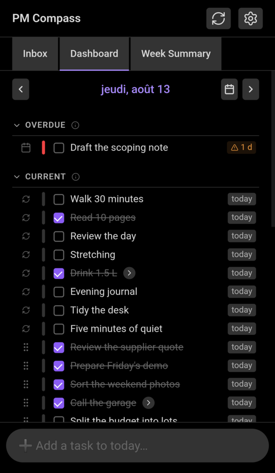
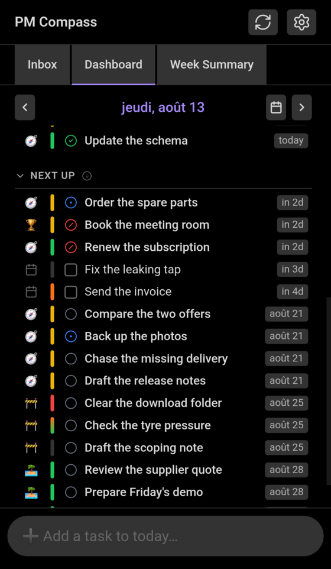
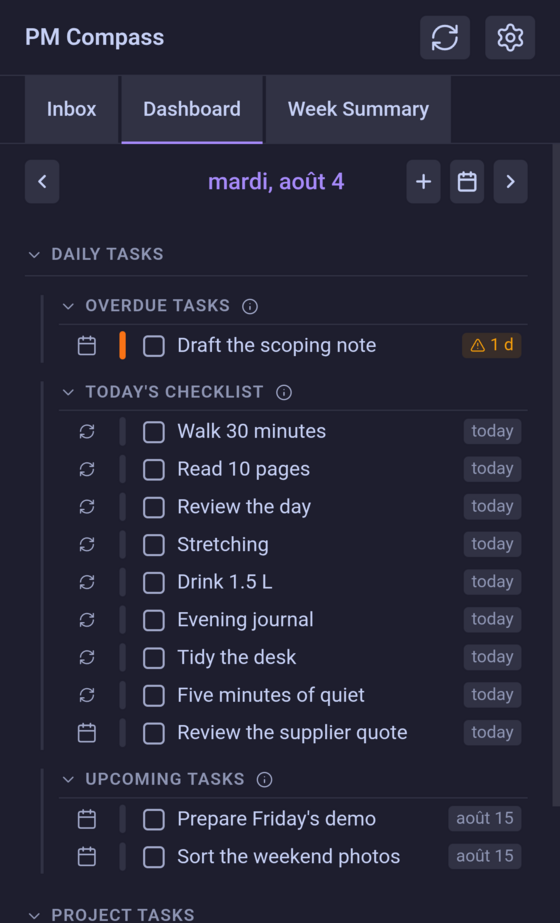
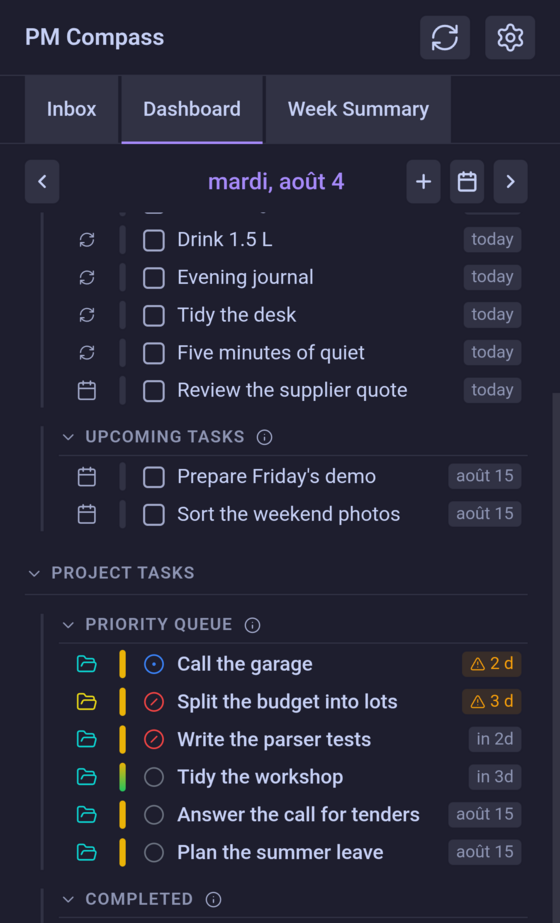
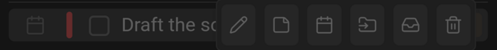
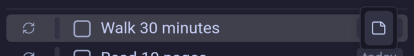
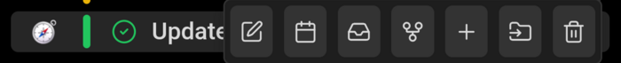

# Dashboard

The Dashboard is the plugin's main tab, and the one place where a day's checklist items and the project tasks show up together.

Open it from the ribbon icon in the left sidebar, or from the command palette with **Open project manager dashboard**. It opens as a tab; asking again brings the tab you already have forward rather than making a second one.

## The screen

*The default display.*

One day is selected at a time, from the bar under the tabs, and **everything below reads against that day**: which checklist is shown, which days count as past or coming, whether a deadline is late, and what a new task is added to. The date itself opens that day's note, creating it if it doesn't exist yet.

Everything on the Dashboard is a view onto files you own: ticking a box edits a line in a daily note, changing a status edits a task note. There is nothing else to keep in step.

## Task displays

Two settings decide how the tasks are arranged, and between them they give four displays:

|  | **Split the task lists into sections** on | off |
|---|---|---|
| **Merge daily and project tasks** on | three horizons: Overdue, Current, Next up | one list, in that same order |
| off | two groups, each with its own sub-sections | two groups, each one list |

### Merged

Merged, a checklist item and a project task of the same date sit side by side, and the three horizons are the whole arrangement:

- **Overdue** — unclosed checklist items from the previous days, and project tasks past their due date. Deepest overdue first.
- **Current** — the day's own checklist, then the project tasks due that day. The checklist keeps the order it has in the note, which is also the only list you can reorder by dragging. Work closed on the day sits at the end, whatever its date said: a closed row is a record of the day rather than something still to do.
- **Next up** — the coming days' items and the tasks waiting behind them, nearest deadline first. A task with no deadline at all belongs to no horizon and waits in the [Inbox](inbox.md) instead.

*Merged — under Next up, project tasks (folder mark) and checklist items (calendar mark) share one date order.*

### Grouped

Turning **Merge daily and project tasks** off gives each kind its own group:

- **Daily Tasks** — *Overdue tasks* (unclosed items from the past days), *`<Day>`'s Checklist*, and *Upcoming tasks* (the coming days). Each row from another day carries a date label that opens that day's note.
- **Project Tasks** — the *Priority Queue*, every dated task most urgent first, overdue at the top; and *Completed*, the project tasks closed on the selected day, which is absent on a day that closed nothing.

*Grouped, split — the Daily Tasks group.*

*…and the Project Tasks group below it.*

### Sections off

Turning **Split the task lists into sections** off changes no order and drops no row: each group becomes a single list, its sub-headings gone, holding exactly what the sections held, in the same sequence — overdue first, the day's own work next, what's coming after it. Merged and unsplit is therefore the whole tab as one list, where the date badge on each row is the only thing saying which horizon it belongs to.

How far the Dashboard looks either side of the selected day is set in the plugin's settings, by **Unclosed items — days before** and **days after**. The window applies to both kinds of row: the notes it reads, and the [Inbox](inbox.md) items planned for those days.

## Kinds of task

Every row has the same skeleton — a mark saying where it comes from, a coloured priority ribbon, a box or status glyph, the title, and a date badge — so the lists line up whatever they hold. What changes is the actions: clicking or tapping a row reveals its buttons.

A date badge reads against the selected day rather than the real today ("today", "in 2d", or an overdue count with a warning glyph), and clicking one takes the Dashboard to that day.

### Checklist item

A calendar mark, a checkbox that ticks the item off in its note, and, from left to right:

-  **Edit title** — rewrites the line's text in the day's note.
-  **Add note** — writes free text as indented lines under the item, which the row's chevron shows and hides. On an item that already carries one it reads **Remove note** and takes those lines away, asking first unless you have turned that question off.
-  **Reschedule** — moves the item to another day.
-  **Promote to project task** — turns the line into a real project task under a project you pick, carrying its dates, tags, priority and attached notes across, and removing the line from the note it was in. This is the way out for something that was never a one-day job.
-  **Move to inbox** — takes the item off the day and back into the [Inbox](inbox.md), the untriaged list.
-  **Delete** — removes the line and anything indented under it.

### Recurring habit

A habit carries the recurring mark instead of a date, and one button:

-  **Add note** — free text under this day's occurrence, as on any checklist item.

Its title, its schedule and its order belong to the habit's definition in the settings, and the line in each day's note is rewritten from it — so there is nothing here to rename, move or delete, and its rows can't be dragged into another order.

### Project task

A folder in its project's own colour, so a row says which project it belongs to at a glance, and a status glyph, which opens the status list:

 To Do &nbsp;  In Progress &nbsp;  Blocked &nbsp;  Review &nbsp;  Done &nbsp;  Cancelled

Done and Cancelled are the two that close a task: it leaves the active sections, and shows up under Completed on the day it was closed. Its buttons:

-  **Edit task details** — opens the task's editor for its title, status, priority, dates and description; ctrl-click opens the task's note instead.
-  **Set deadline** — picks the task's own due date, or clears the one it has.
-  **Move to inbox** — clears that deadline, which drops the task off every horizon and leaves it waiting in the Inbox. It only appears on a task holding a deadline of its own: one whose deadline is inherited from a parent has nothing to clear.
-  **Open in graph** — shows the task in the [Task Graph](graph-display.md), among the tasks it depends on and those waiting for it.
-  **Add subtask** — creates a task under this one, in the same project.
-  **Move task** — moves it, with every subtask under it, to another parent or another project.
-  **Delete task** — deletes the task and the subtasks under it.

A row may also carry an amber warning glyph after its title, flagging a task that is still open under a parent already marked completed, or one marked completed while it still hides open subtasks.

## Under the hood

### Loading

One model layer holds every task the plugin has read: the selected day's note, the notes for the days around it, every project and task note under the projects folder, and the [Inbox](inbox.md) note. It starts filling that from the moment Obsidian loads the plugin, so the tab usually has its rows before you open it, and when a note changes it re-reads that note and no other. Before a refresh, the current week's daily notes get any missing recurring habit lines written into them, so the checklist is complete before it is read.

The Inbox is read because some of the day's rows live there. An item scheduled onto a day that has no note yet is not written into that day: it stays in the Inbox carrying the day as its target, and the Dashboard places it in that day's horizon all the same. Closing such a row records it as done under today rather than writing into the Inbox, and its Inbox button reads **Unplan**: there is nothing to move, so what it offers is dropping the target day and leaving the item in the Inbox.

Reading the neighbouring days is the slow part — dozens of notes, a few at a time. The day's own checklist and the project tasks appear straight away, and the Overdue and Next up sections take those days' rows as each note comes back, deepest overdue first.

### Ranking

Priority and deadlines flow downhill: a task with no deadline or priority of its own takes its parent's, whichever is the more urgent, so a deadline set once on a project task is felt everywhere underneath it. A subtask under a critical parent ranks as critical.

The Priority Queue then scores every dated task by how close its deadline is, with priority breaking the ties — overdue work outranks everything else, and nothing can climb past it. When the two kinds of task are merged, the three horizons are cut out of that same ranked queue, so a task's place is decided once and only the presentation changes.

### Staying in step

The Dashboard watches the files it drew from — the day notes it read and everything under the projects folder — and redraws when one of them changes, however that change was made: here, in another tab, by hand in the note, or by a sync from another device.

Because a refresh rebuilds the whole tab, the things that should outlive it are remembered on purpose: which sections are folded, where you had scrolled to, which notes you had expanded, and which tab you were on.
