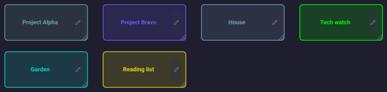
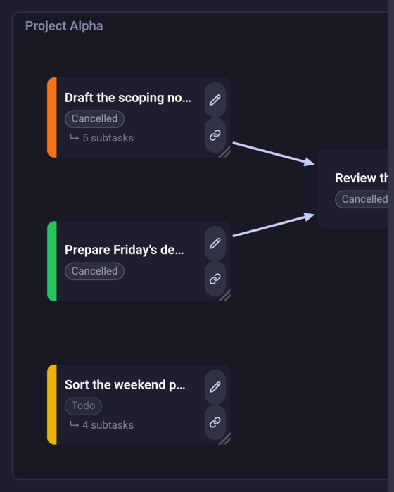
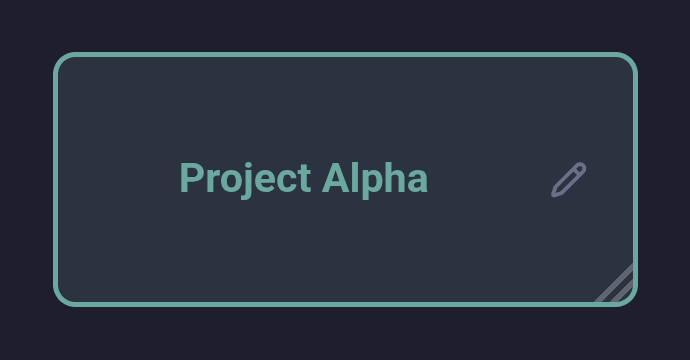
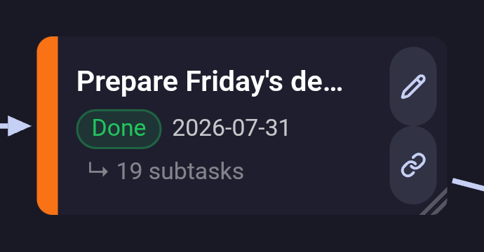
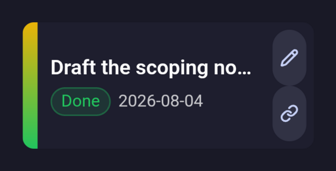
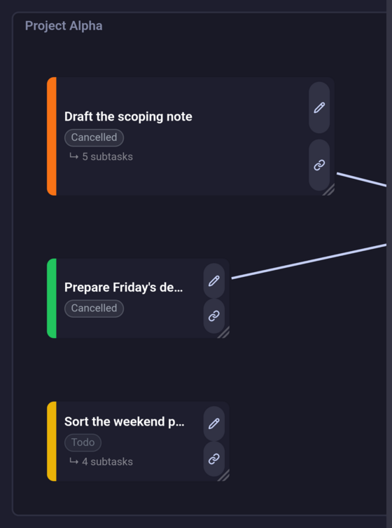
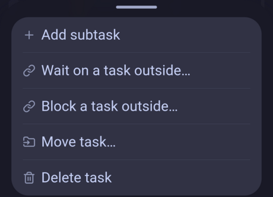

# Task Graph

The Task Graph is where a project's tasks are laid out as cards and the dependencies between them are drawn as arrows.

## The screen

*The graph opens on the projects, in rows cut to the width of the panel the first time it draws them.*

**One level is drawn at a time**, and the trail at the top left says where you are: *All* for the projects, then the project you went into, then each task below it. It names the way back rather than where you are.

Two taps on a card go one level deeper. Everything on the screen acts on the level you are on.  *Open in graph* on a [Dashboard](dashboard.md) row is the other way in: it opens the level holding that task and picks its card out.

The gear opens the display options:

- **Active only** — leaves out the finished tasks, a task under a finished parent among them, and the archived projects.
- **Reset layout** — drops every card position, in every project, leaving the sizes. It asks first, naming how many notes it would edit, and does nothing when no card has a position. **Ask before resetting the graph layout** in the [settings](../technical/settings.md) turns the question off.
- **Reset card size** — the same for the sizes, leaving the positions alone, behind the same question.

Where a card sits and how big it is are stored in the task's or project's own note, so they travel with the vault and are the same on every device that syncs it. Moving or resizing a card does not mark the note as changed; every other edit here — a status picked from a card, a dependency drawn, a task moved — does.

## Inside a project or a task

*A chain wider than the panel scrolls sideways, the frame growing to hold whatever is inside it.*

The frame is what you drilled into — the project, or the task above this level. Its own cards sit inside it: a project's root tasks, or the children of the task you went into. A level holding nothing still draws its frame, saying so inside it.

**Arrows run left to right: what comes first, then what waits on it.** Dragging a card overrides where the layout put it, and the frame grows around wherever you leave it. A card made bigger pushes its neighbours aside rather than covering them; see [Automatic placement](#automatic-placement).

## Kinds of card

### Project card

Its title in the project's own colour, and a pencil that opens the project's editor. Tapping anywhere else goes into the project. A long press — a right-click on a desktop — offers **Add task**, which creates a task at the project's root.

### Task card

Under its title the card carries:

- **Priority** — the coloured bar down the leading edge; clicking it sets the level, which is written to the task's note. It takes two colours when a task and its family disagree, urgency flowing both ways: the top half is the most urgent level at or above the task, the bottom half the most urgent at or below it. One colour means the two agree.

  

  *Two colours: this task is low priority, but a parent above it is medium.*

- **Status** — the pill on the left of the meta line; clicking it opens the six the [Dashboard](dashboard.md#project-task) lists, Done and Cancelled being the two that close a task.
- **Deadline** — the day the task is held to, in red once it has gone by.
- **Subtasks** — how many the card is hiding one level down.

The two buttons on its trailing edge:

-  **Edit** — opens the task's editor; ctrl-click opens its note instead.
-  **Connect** — press it and drag onto another card to make this task wait on that one. Cards the link may not reach refuse the drop.

**Its bottom-right corner resizes it.** Pull it and the card grows from its top left, the drawing making room as you go; let go and the size is kept on the task's note.

*A title too long for a card is cut short; a bigger card shows it whole, and the cards below move down rather than being covered.*

The size is the task's, not the level's: the same task drawn faded on another level is drawn just as big there.

Tapping the card selects it, and tells the [Dashboard](dashboard.md) to highlight the same task. Two taps go into it. A long press opens the rest:

- **Add subtask** — creates a task under this one, which is one level further in.
- **Wait on a task outside…** and **Block a task outside…** — make a dependency to a task this level doesn't draw, choosing it from a list instead of dragging to it. The two differ only in which end this task is at. Each is left off the menu when it has nothing to offer, which is always the case at the top of a project: a project's neighbours are other projects, and a dependency never crosses one.
- **Move task…** — moves the task, with every subtask under it, to another parent or project.
- **Delete task** — deletes the task and everything under it.

A long press on the empty space of a level offers the same *add* for the level you are on.

### Dotted card

A task from outside this level, drawn faded because a dependency reaches it — on the left when it comes first, on the right when it waits. It carries no buttons and no menu, and cannot be selected, resized or opened. It can be dragged, but not into the frame, and where it is left is not remembered. Its size is the task's own.

### Dependency line

How a line is drawn says what it stands for:

- **Solid** — a dependency between two of this level's own tasks.
- **Dashed** — one with an end that isn't: a task below the level, or one outside it.

The frame is an end like any other: the task the level belongs to has no card among its children, so its own links land on it.

What a line takes:

- **Long-press it** to remove the dependency.
- **Drag either half of it** onto another card to re-point that end. The half you grabbed is the end that moves. This is the only way to point a dependency at a task the level doesn't hold, since the connect button starts from a card's own identity and a dotted card has none.

## Completion warnings

An amber glyph on a card — and on the same task's [Dashboard](dashboard.md) row — says its state disagrees with the tasks around it:

-  **Completed, and still holding open subtasks.**
-  **Still open, under a parent already completed.**

Nothing is corrected for you; the glyph only says which way the tree is out of step, and it goes as soon as it is.

## Moving a task

Three ways, all doing the same thing: the task moves with every subtask under it, keeping the dependencies its new place can still hold, and only changing files when it changes project.

- **Move task…** from its menu — opens a picker of the projects and their tasks, revealed one level at a time. Selecting a project row means that project's root, a destination you may not pick is greyed out with the reason, and the eye at the top right hides finished tasks.
- **Dropping its card on another card** — moves it under that task. A card the move would be refused for never lights up, and the dragged card goes back where it started: a move changes the tree, not the drawing.
- **Dropping its card on an entry in the trail** — moves it back out, to that project's root or under that ancestor task, which is the one direction dropping on a card cannot express.

## Under the hood

### What a dependency may join

Two tasks in the same project, neither of them an ancestor of the other, and not in a way that would loop back on itself. A task and its own subtask are refused because there is no level on which the two are separate cards, so nothing could be drawn.

### Automatic placement

The cards are sorted topologically — each one after everything it waits on — and placed in that order, which is what lays a level out left to right. Only the cards you have not put somewhere by hand take part; the others stay where they are and the rest are laid out around them.

Each card goes as far left as its prerequisites allow, and is then placed vertically without touching a card already drawn. So a chain runs straight across instead of stepping down the page, and no two cards overlap, whatever size they have been given.

A card at the start of a chain is then centred against what follows it, where there is room.

The projects at the top of the trail have no order but their titles, so they are laid out in rows cut to the panel's width. That runs once: each card's place is stored on its project and reused from then on.

### Where an arrangement is kept

A **Card layout** property on the note holds it — the task's own, or the project's for a card in the grid. It carries up to four numbers: the centre the card was dragged to, and the size it was made. The two pairs are independent, so a card can have been dragged and never resized. The property is this plugin's own; Project Manager neither writes nor reads it, and a note whose card has never been moved or resized has no such property.

Moving a task to another parent or project forgets where its card sat — that place was among the siblings it has left — but keeps how big it was, since that is the same question wherever the card is drawn. The two reset buttons split the same way, each dropping one half and leaving the other; dropping the last half left takes the property off the note.

### Keeping up with the vault

The graph redraws when a project or task note changes, however the change was made — from here, from the Dashboard, or by hand in the note. Deleted tasks drop out of the trail on the way, so a level whose task no longer exists steps back to one that does rather than drawing an empty frame.

Project Manager keeps nesting in **two places**: the subtask's note names its parent, and the parent — or the project, at the root — lists what hangs off it. Both are kept in step, every move rewriting the two, and **Check project listings when the dashboard opens** putting back whatever has drifted since.
