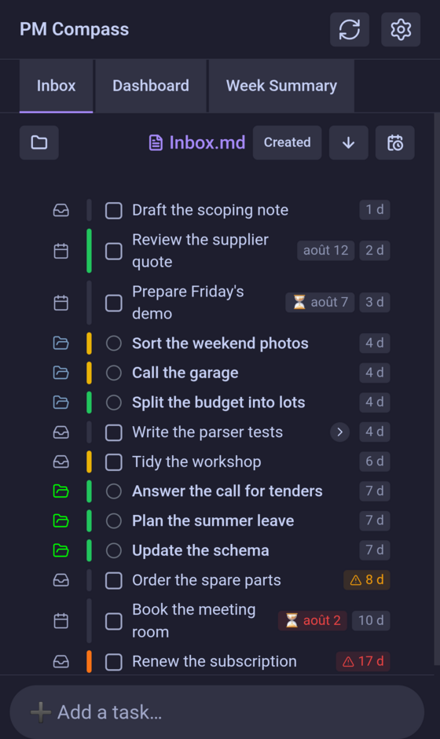
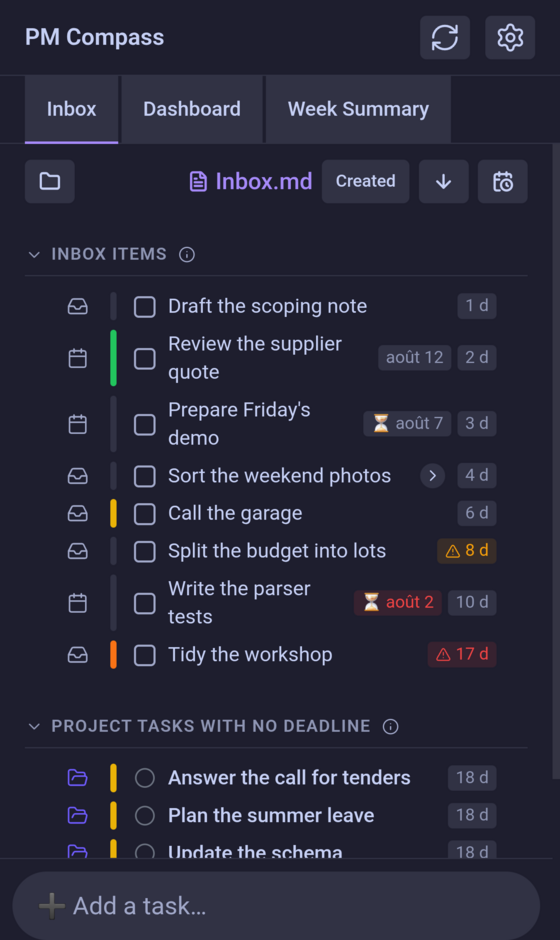
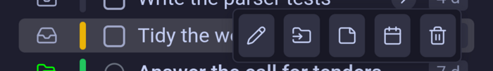
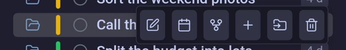

# Inbox

The Inbox is where a task waits when it has no day yet: capture it now, decide later what to do with it.

## The screen

*The default display, newest first.*

Everything on this tab lives in **one Obsidian note** (Inbox.md, as indicated by the **Inbox file** setting) where each item is an ordinary checklist line you can edit by hand.

Capture happens in the field at the bottom: a title and ⏎ append a line stamped with today's date.

## Displays

***Merge daily and project tasks* off — the two kinds keep their own lists, each foldable.*

The tab holds two kinds of work. *Inbox items* are the Inbox note's own lines, the untriaged ones. *Project tasks with no deadline* are the project tasks that carry a priority but nothing dates — the [Dashboard](dashboard.md) arranges work by day, so a task with no date has no place there and waits here instead. Giving one a deadline moves it onto the Dashboard, and the Dashboard's **Move to inbox** clears that deadline to send it back. The second section stays even when the project filter empties it, so an empty list never reads as "there are none".

Turning **Merge daily and project tasks** on — the default, and the screen above — drops both sections for one untitled list, ordered as a whole.

## Order and filters

The trailing end of the bar orders the list; the leading end narrows it. Each control keeps its state between sessions.

- **Sort mode** — the button naming the current one opens the list of five: *Created*, *Priority*, *Deadline*, *Title* and *Default*. Its tooltip spells out what each one settles ties by. *Default* is the order of the lines in the Obsidian note itself, which is the one order that note can hold — so it is also the only mode in which rows can be dragged into another position, by the grip that appears at their leading edge. Merged, it puts the project tasks last, having no line in that note to sit among. *Deadline* is offered greyed out when nothing in the list carries one.
-  **Direction** — flips the mode in effect, and each mode remembers its own. The arrow and its tooltip name the direction you are looking at, not the one a click would give — "Newest first — click for Oldest first". Rows missing the key being sorted on stay at the end either way.
-  **Hide planned items** — takes out the items already aimed at a day, leaving only what still needs a decision. The button then reads  **Show planned items** and counts what it is holding back.
-  **Filter by project** — ticks projects on and off; unticking one drops its tasks from the list. It only ever narrows the project tasks — the Inbox's own lines are the untriaged work and belong to no project, so they stay whatever is ticked. The glyph turns to  while anything is hidden, and the count of hidden tasks is written under the list. The picker stays open while you tick several; *All projects* clears it, or unticks everything so you can tick back the one or two you want.

## Kinds of item

Both kinds share the same skeleton — a mark saying where the row comes from, a coloured priority ribbon, a box or status glyph, the title, and its date badges — so the two lists line up. Clicking or tapping a row reveals its buttons. Clicking a date badge takes the Dashboard to that day.

### Inbox item

A line in the Inbox note. It leads with the inbox mark, or with a calendar mark once it carries a day of its own, and its ribbon sets the priority written into the line. The box **closes** the task: the line leaves the Inbox and is added to *today's* daily note, ticked, with the day it was closed on. Closing here is not deleting — it leaves a record on the day the work actually happened rather than the day it was captured.

-  **Edit title** — rewrites the line in the Obsidian note.
-  **Promote to a project task** — turns the line into a real project task under a project you pick, or a new one. This is the answer to an item that has been aging here: it was never a one-day job, it needed a home.
-  **Add note** — a note in the plugin's sense: free text kept as indented lines under the item, which the row's chevron shows and hides. On an item that already carries one it reads **Remove note** and takes those lines away, asking first unless you have turned that question off.
-  **Schedule for a day** — moves the item, unchanged, into that day's daily note, creating it if it doesn't exist yet. On an item already aimed at a day the picker also offers clearing that target.
-  **Delete** — removes the line and anything indented under it.

Note: A recurring habit that carries the habits tag can appear here too. It offers neither *Edit title* nor *Promote*: its wording comes from the habit's definition in the settings and is rewritten from it, so a rename here would not survive and a promotion would strand it.

### Project task with no deadline

A folder in its project's own colour, and a status glyph that opens the status list. Its badge is the day it was created, so the two kinds are ranked by the same thing: how long they have been waiting. Its buttons are the [Dashboard](dashboard.md#project-task)'s, save for *Move to inbox* — a task with no deadline has nothing to clear.

-  **Edit task details** — opens the task's editor for its title, status, priority, dates and description; ctrl-click opens the task's note instead.
-  **Set deadline** — gives the task a due date, which is what moves it out of here and onto the Dashboard.
-  **Open in graph** — shows the task in the [Task Graph](graph-display.md), among the tasks it depends on and those waiting for it.
-  **Add subtask** — creates a task under this one, in the same project.
-  **Move task** — moves it, with every subtask under it, to another parent or another project.
-  **Delete task** — deletes the task and the subtasks under it.

## Under the hood

### Age and staleness

Every item shows how long it has been in the Inbox, counted from the day it was captured. Past the **Inbox — stale task threshold (days)** setting the badge turns amber and takes a warning glyph, and past a fortnight — or past the threshold itself, if you set it higher — it turns red, so a badge never reddens before it has warned. While anything is stale the Inbox's own tab button carries a warning badge, so a pile-up is visible from the other tabs. Setting the threshold to 0 turns the warning off; the badge itself stays.

An item planned for a day is exempt: its age is shown plainly, whatever it has reached. It isn't untriaged work piling up — it has been dealt with, and is waiting.

### Planned days

Scheduling an item for a day whose daily note doesn't exist yet leaves it here, carrying that day as a target. The Dashboard still places it in that day's horizon, and closing it there records it under today as usual. It moves into that daily note for real as soon as it exists, and until then a target day that has gone by turns red — the day passed and nothing was written.

### Promotion

Promoting is a **one-way conversion**, not a link: the new task file carries the line's title, tags, dates, priority and the notes attached to it, and the line itself is removed once the task exists. Nothing connects the two afterwards, and there is no way back.

An item with no priority marker lands as *medium* rather than unset, which is what keeps it from sorting below every task that has one. Where you drop it decides the rest: at a project's root it becomes a plain task listed in that project's note, under a task it becomes a subtask of it. Picking *New project…* writes the project note first, complete enough that nothing can tell it from one made in Project Manager itself.
