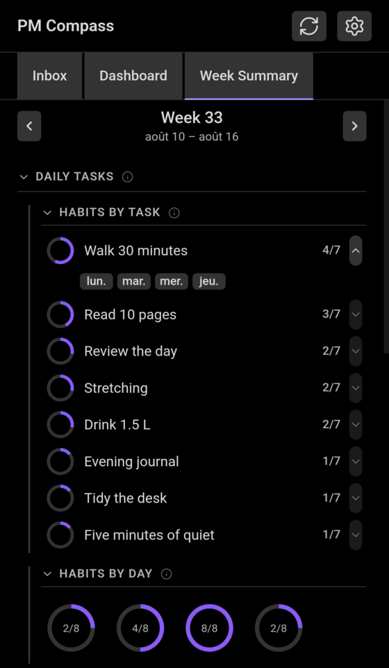
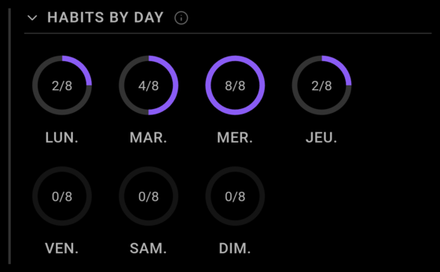
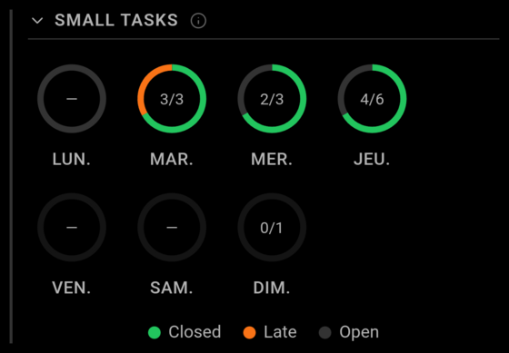
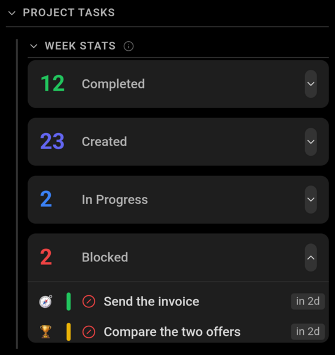

# Week Summary

The Week Summary is the review tab: one week at a time, how much of it got done. It only reads — nothing here changes a task.

**One week governs everything below**, Monday to Sunday, named in the bar at the top. The arrows step a week at a time, and a *This week* button appears as soon as you have left the current one.

## Daily tasks

This section reads the week's daily notes and splits them in two: the recurring habits, and every other checklist line. Which lines are habits is decided by the **Daily habits tag** setting — see [settings](../technical/settings.md).

### Habits by task

*One habit expanded onto the days it was checked, by the arrow at the end of its row.*

One row per habit, the ring and the count reading *days checked out of days the habit appeared*. A habit is present on a day only if its line is in that day's note, so one added mid-week is scored out of the days it has actually run, not out of seven. One never checked is greyed out, and carries no arrow: there is nothing to open.

The arrow at the end of a row opens the days it was checked; each chip opens that day's note.

### Habits by day

*Wednesday's ring is full: all eight habits ticked.*

The same habits counted the other way round: one ring per day, filled with how many of that day's habits were ticked. A day reads "—" when there is nothing to count: no daily note, or a note holding no habit line — the second drawn as an empty ring rather than a dimmed one, an empty day being a different thing from an absent one.

A day still to come is dimmed but counted all the same. The week's habit lines are written into its note before the day arrives, so it reads none of them ticked rather than "—".

### Small tasks

*Tuesday's orange sliver is one task closed late; Monday's note holds habits but no small task, so its ring reads “—”.*

The day's other checklist items in a ring of three colours: green for what was closed on the day itself, orange for what was closed late, and the grey remainder for what is still open. The count in the middle is everything closed over everything there was. "—" reads as it does above: no note, or a note holding none of these items — which is the commoner of the two here, since a day can have habits and no small tasks.

A ring opens that day's note; a day that has none is not clickable.

## Project tasks

*Each figure expands onto the tasks behind it.*

Four figures counted from the task notes rather than from any daily note. Two are about the week on show, two are about right now:

- **Completed** — tasks closed on a day of this week.
- **Created** — tasks created on a day of this week.
- **In Progress** and **Blocked** — tasks carrying that status *today*, whenever they came to it. Stepping back through the weeks does not change either figure. A task under a parent that is done or cancelled is left out: what is in force for it is the ancestor's status, not its own.

A row expands onto its tasks, listed as the [Dashboard](dashboard.md) lists them but with no buttons, and showing the priority and deadline in force — so a subtask that takes its urgency from its parent shows the parent's.

## Under the hood

### Missing daily notes

A day whose daily note doesn't exist counts as a day with nothing. Reading the week never creates one, so stepping through past weeks leaves the vault untouched.

### On time and late

A checklist line counts as closed on time when it is ticked and either carries no completion date or carries one on or before the day of the note it sits in. Ticked with a later date, it is late. So a line rescheduled to another day and closed there counts against the day it was done on, not the one it was written for.

### Habits are grouped by name

The rollup keys a habit on the text of its line, not on the definition it came from. Renaming a habit part-way through a week therefore leaves two rows for it, one per wording — which is also what keeps the days before the rename counted correctly, since the lines already written into those notes keep the old text.

### Archived projects still count

A project put away stops appearing on the other tabs, but its tasks stay in these figures. Archiving is filing something away, not undoing the week it had.
