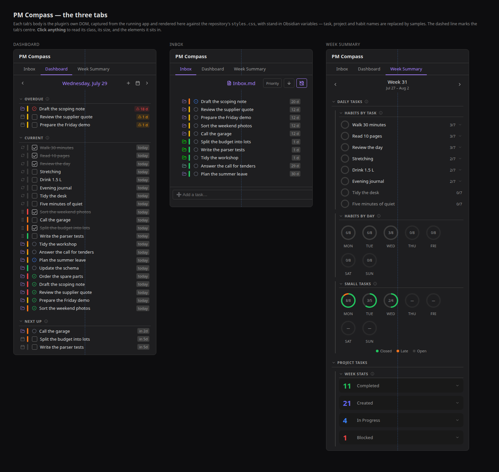

# Preview — seeing a style change without Obsidian

Looking at a change to `styles.css` means either rendering it in a browser or measuring it
in the app. These are the tools for both. Nothing here is part of the build: `esbuild` only
produces `main.js`, and `release.mjs` copies `main.js`/`manifest.json`/`styles.css`.

For a computed value neither the render nor the inspector shows — how a `minmax()` resolved,
the size of each grid track — append a throwaway line to `tabs.html` that writes it into a
`<pre id="probe">`, then read it back without opening a window:

```bash
google-chrome --headless=new --no-sandbox --disable-gpu --allow-file-access-from-files \
  --virtual-time-budget=2000 --window-size=1500,1420 --dump-dom "file://$PWD/tabs.html" \
  | grep -o 'id="probe">[^<]*'
```

That is how the bar's column sizing was settled — `getComputedStyle(bar).gridTemplateColumns`
showed the button group's track shrinking under its own buttons.

## `tabs.html` — the three tabs



Each tab's body is the plugin's **real DOM**, captured from the running app, rendered here
against the repo's own `styles.css`. The only thing the page draws over it is a dashed line
at the tab's centre — what the bar's middle grid column is meant to hold (see
[dashboard.md](../dashboard.md#date-navigator)).

**Open it in a browser and click anything.** The captured markup carries no handlers of its
own, so every click is free to report what that element is: its `pm-` classes, its rendered
size, and the chain of elements it sits in, each step selectable in turn. Esc closes it. The
highlight is positioned in page coordinates, so it stays on its element as the page scrolls.

Re-render the screenshot after a CSS change — no device needed, the captured markup is in
`tabs.js`:

```bash
cd docs/preview
google-chrome --headless=new --no-sandbox --disable-gpu --allow-file-access-from-files \
  --hide-scrollbars --virtual-time-budget=3000 --window-size=1500,1420 \
  --screenshot=tabs.png "file://$PWD/tabs.html"
```

### Re-capturing the markup

Needed only when the **markup** changes — a new row part, a section that moved. It reads the
live DOM over the WebView debugger and writes `tabs.js`:

```bash
./scripts/deploy-android.sh /sdcard/<vault>    # puts the debugger on localhost:9222
node docs/preview/capture.mjs
```

`capture.mjs` replaces every task, project and habit name with sample text, and strips every
`title`/`aria-label`, **on the device, before the markup is serialised** — none of which is
visible in a render anyway. Check what came back before committing it:

```bash
node -e "global.window={}; eval(require('fs').readFileSync('docs/preview/tabs.js','utf8'));
  const w=new Set(); for (const k in window.TABS)
    window.TABS[k].replace(/<[^>]+>/g,' ').split(/\s+/).forEach(x=>x.length>2&&w.add(x));
  console.log([...w].sort().join(' '))"
```

## `cdp.mjs` — driving the plugin on a phone

Evaluates an expression in Obsidian's WebView and prints the result (Node 22+, no
dependencies — it uses the global `WebSocket`). Same `localhost:9222` forward as above.

```bash
node docs/preview/cdp.mjs "app.plugins.plugins['pm-compass'].manifest.version"

# switch tabs and measure, which nothing else can do:
node docs/preview/cdp.mjs "(async () => {
  const v = app.workspace.getLeavesOfType('pm-compass-dashboard')[0].view;
  v.activeTab = 'tasks'; await v.render();
  const r = (s) => { const q = document.querySelector(s).getBoundingClientRect();
    return Math.round(q.left) + '..' + Math.round(q.right) + ' h' + Math.round(q.height); };
  return JSON.stringify({ bar: r('.pm-dash-date-nav'), label: r('.pm-dash-date-text') });
})()"

adb exec-out screencap -p > /tmp/phone.png
```

`activeTab` is `"inbox"`, `"tasks"` or `"stats"`. The view skips rebuilds while it is
off-screen, so reveal its leaf first if the drawer is closed.
