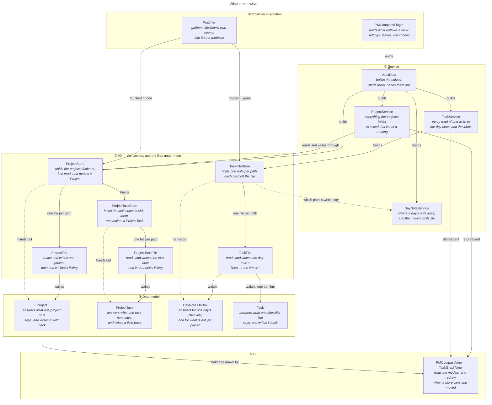
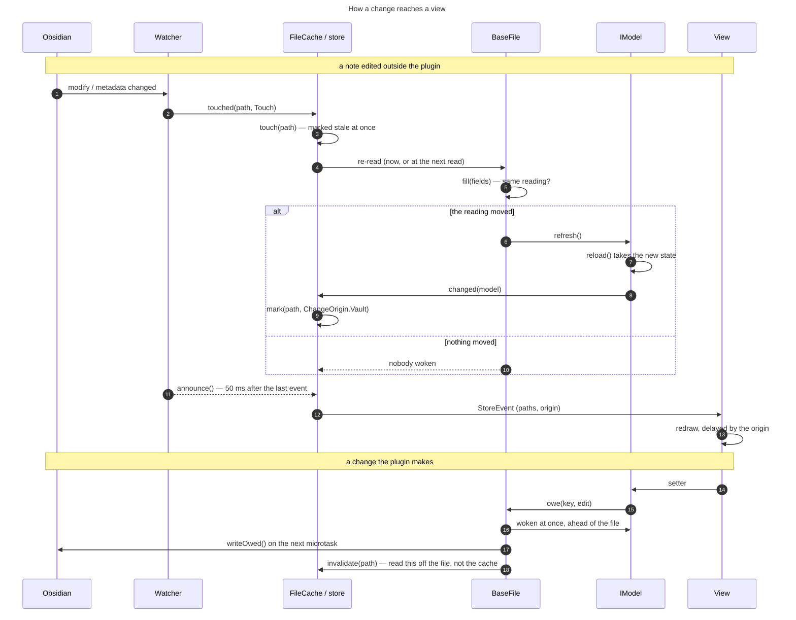
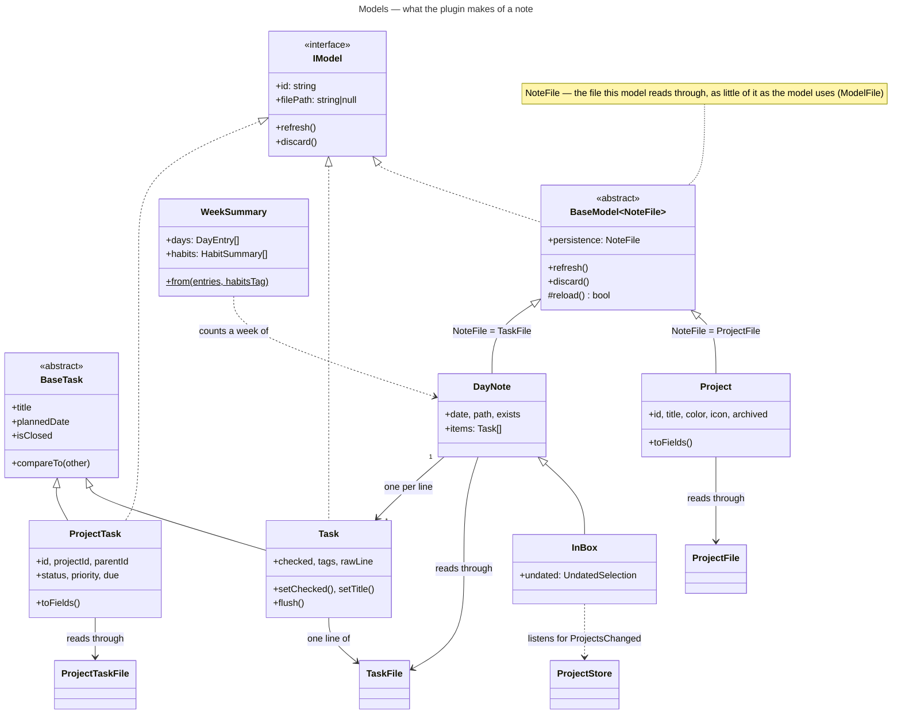
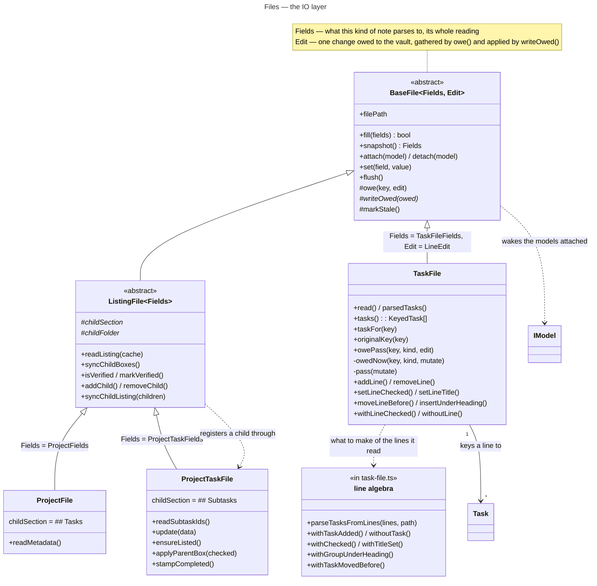
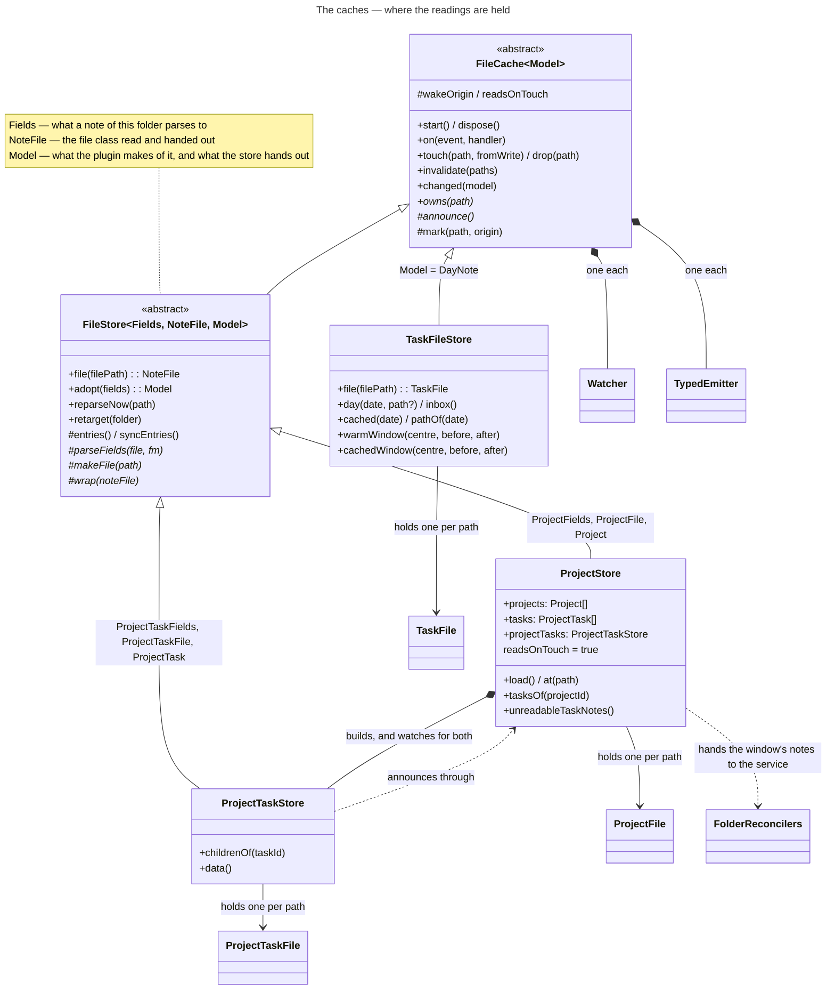
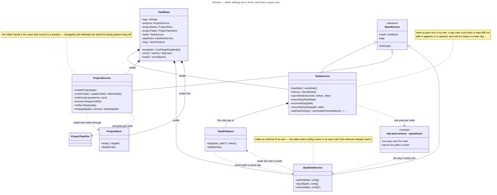
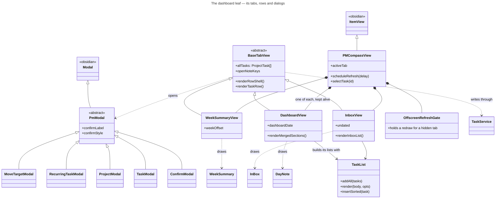
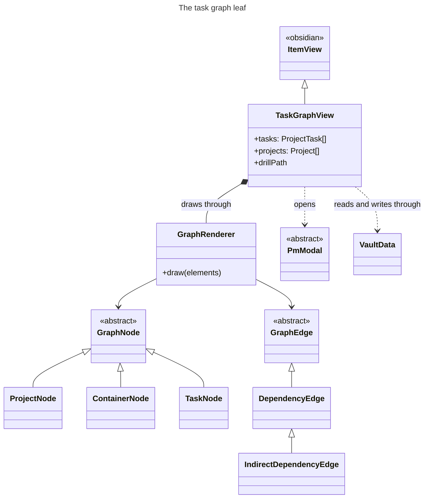
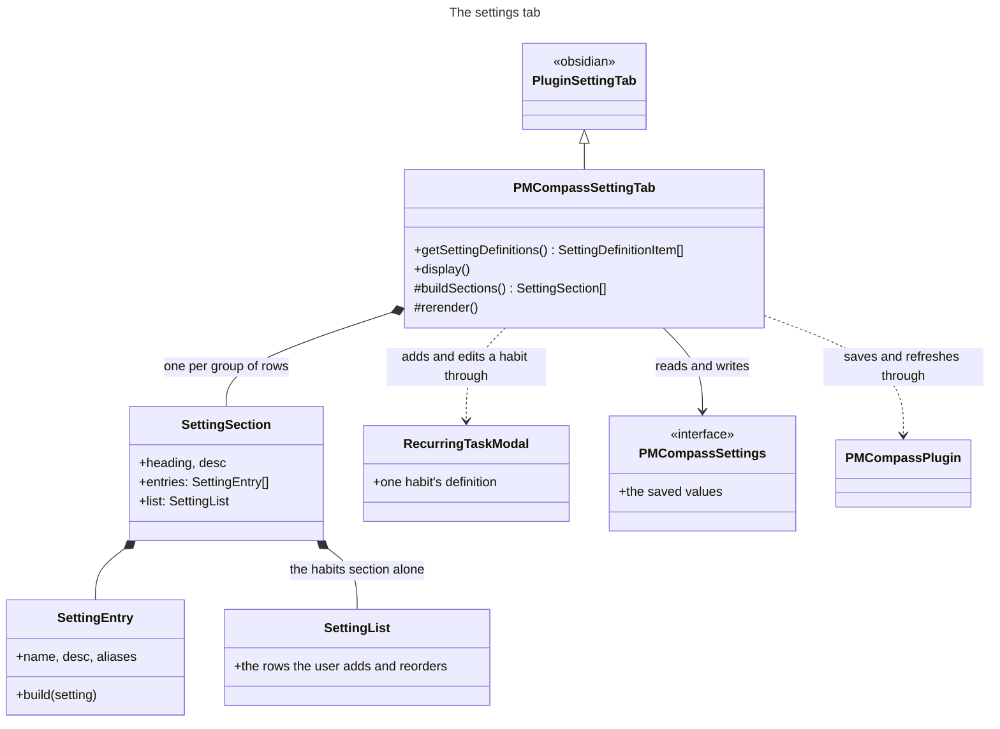

# Data model — the classes and what each is for

The plugin reads and writes ordinary markdown, and holds one live reading of every note it cares about. This document is what each class in that arrangement is responsible for, in the order the layers stack: the models a view holds, the IO underneath them — the files, and the caches that hold one reading per path — the service over those, and the watching that keeps all of it in step with the vault.

The diagrams are generated from `docs/technical/diagrams/*.mmd` by `pnpm docs:diagrams`, which also writes [class-map.html](class-map.html) — the same drawings on one page, for reading offline. Edit a `.mmd` and re-run the pass; the fences below are filled from it.

Two things beside it have documents of their own: the passes that write to the vault, in [operations.md](operations.md), and the listing subsystem — `## Tasks` / `## Subtasks` and how they are kept honest — in [task-listings.md](task-listings.md).

## How the layers fit

<!-- diagram:overview -->

<!-- /diagram -->

The names say the split: a **Project** is the project, a **ProjectFile** is the file behind it. A file reads its note, keeps that reading, and wakes the models attached to it; the models take the reading into state of their own, so what the plugin passes around is a live object rather than a copy that falls behind. A view holds models and redraws when its store says something moved.

That gives one rule per layer.

- A **model** never touches the vault. It holds a reading and answers what a view draws from.
- A **file** never decides what a change means. It reads its note, writes what it is owed, and wakes the models over it.
- A **cache** never parses a note itself. It says which paths are its own, when the re-read happens, and what a view is told.
- An **operation** holds nothing at all. It makes one pass over the vault — see [operations.md](operations.md).
- A **service** holds no reading. It holds which settings are in force, and when a pass runs.

<!-- diagram:change-flow -->

<!-- /diagram -->

Three windows sit between a keystroke and a redraw, in a fixed order. A write is gathered on the file and flushed on the next microtask, so ten setters cost one pass over it. A burst of vault events is gathered by the watcher into one 50 ms window. And the view holds its redraw for as long as the change's origin deserves — 2 s for a note being typed into, 50 ms for a write the plugin made and the user is waiting on.

The rule that keeps the middle window honest: **a vault event marks a file stale at once, and only the telling is delayed**. A read taken straight after a write parses what it is owed before answering, whatever the coalescing is doing.

## Models

<!-- diagram:models -->

<!-- /diagram -->

### `IModel` — `src/model/i-model.ts`

**IModel** is responsible for taking a change to the data it holds:

- `refresh()` — that data has changed.
- `discard()` — that data is gone.

A model is identified by `id`, and by the `filePath` its data was read from — null for a model over nothing.

### `BaseModel<NoteFile>` — `src/model/base-model.ts`

*abstract, implements `IModel`*

**BaseModel** is responsible for holding one note's reading and for announcing a change only when there is one:

- `refresh()` calls the abstract `reload()` and tells the store only when that reports the state moved.
- `discard()` detaches and announces the loss once, however often it is called.
- `reload()` is what a subclass answers, and all of it.

Its generic parameter `NoteFile` extends [**ModelFile**](#modelfile--srcmodelbase-modelts), and is the file this model reads through.

### `ModelStore` — `src/model/base-model.ts`

**ModelStore** is responsible for collecting the changes models report — `changed(model)` — and passing them on to whoever listens. The IO layer listens to it, through [**FileCache**](#filecachemodel--srcmodelstorefile-cachets).

### `BaseTask` — `src/model/base-task.ts`

*abstract*

**BaseTask** holds the information every task — [**Task**](#task--srcmodeldailytaskts), [**ProjectTask**](#projecttask--srcmodelprojectproject-taskts) — needs to be rendered or sorted:

- its `title`, and the `rowTitle(habitsTag)` a row prints.
- its `statusValue` and the `statusScale` it can be set to, and `isClosed`.
- its `ownPriority`, and the `priorityInForce` the tree around it makes.
- its dates — `plannedDate`, `ownDue`, `dueInForce`, `createdOn`, `closedOn`.
- its `tagNames`, and where it sits: `filePath`, `fileLine`.
- `compareTo(other, opts)`, which ranks on the `Status` and `Priority` enums declared here.

### `Task` — `src/model/daily/task.ts`

*extends `BaseTask`, implements `IModel`*

**Task** holds what one `- [ ] ` line says:

- its `title`, `checked` box and `tags`.
- its `priority`, off the marker the line carries — 🔺 critical, ⏫ high, 🔼 medium, 🔽 low, ⏬ lowest.
- its dates, likewise — ➕ `createdAt`, ⏳ `scheduledDate`, 🛫 `startDate`, 📅 `dueDate`, ✅ `completedAt`.
- the `rawLine` itself, its `lineIndex`, and the `subLines` indented under it.
- the note it came from: `filePath`, `noteDate`.

Identified by the key its line is filed under, a checklist line carrying no id.

It is made in two shapes:

- **bound**, by [**TaskFile**](#taskfile--srcmodeliotask-filets) through `boundTo(note, key, store, date)` — attached to that note, so a re-read wakes it. This is the live model a view holds. Its setters owe the note a `LineEdit`: what the change does to the note's own reading, and the pass that puts it in the file.
- **parsed**, by `parseTasksFromLines` through `parse(line, index)` — a line turned into a task and nothing more: there is no note behind it, so nothing wakes it and its setters write nowhere. It is how the [line algebra](#the-line-algebra) *reads* a checklist — every task of a day, which lines are checked, which habits are already written down — and how `withoutTask` hands a removed task back to its caller. Changing one line needs none of this: the edit already says which line it is.

### `ProjectTask` — `src/model/project/project-task.ts`

*extends `BaseTask`, implements `IModel`*

**ProjectTask** holds what one obsidian-pm task note says:

- its `title`, `status`, `priority`, `type` and `progress`.
- its dates — `start`, `due`, `completed`, `createdAt`, `updatedAt`.
- its `tags`, `assignees` and `dependencies`.
- where it sits: `projectId`, `parentId`, and the `card` layout the graph left on it.

Identified by the `id` its frontmatter carries. The getters read state taken from the note, the setters write through it. Which tasks are its children is [**ProjectTaskStore**](#projecttaskstore--srcmodelstoreproject-task-storets)'s `childrenOf`.

**Made by** [**ProjectTaskStore**](#projecttaskstore--srcmodelstoreproject-task-storets) alone (`wrap` / `make`).

### `Project` — `src/model/project/project.ts`

*extends `BaseModel<ProjectFile>`*

**Project** holds what one project note says: its `title`, `color`, `icon`, `archived` flag and `card` layout. Identified by the `id` its frontmatter carries. Setting a field writes through the note. Which tasks it holds is [**ProjectStore**](#projectstore--srcmodelstoreproject-storets)'s `tasksOf`.

**Made by** [**ProjectStore**](#projectstore--srcmodelstoreproject-storets) alone.

### `DayNote` — `src/model/daily/day-note.ts`

*extends `BaseModel<TaskFile>`*

**DayNote** is responsible for one day's checklist, kept live: one [**Task**](#task--srcmodeldailytaskts) per line, matched across re-reads by the key that line is filed under, and the lines gained and lost between two readings. Identified by its date and the path of its note.

**Made by** [**TaskFileStore**](#taskfilestore--srcmodelstoretask-file-storets) alone.

### `InBox` — `src/model/daily/inbox.ts`

*extends `DayNote`*

**InBox** is responsible for everything written down and not yet placed, which comes in two halves:

- its own note's lines, held as any day holds them.
- the project tasks carrying a priority but no date, which no dashboard horizon holds.

It picks that second half again on `ProjectsChanged`, and announces only when what it holds moved.

### `WeekSummary` — `src/model/daily/week-summary.ts`

**WeekSummary** is responsible for aggregating a week of days into per-day completion counts and per-habit grids. `WeekSummary.from(entries, habitsTag)` builds one from the seven days it is handed and counts them there and then — the constructor is private, so there is no half-filled summary to fill in afterwards, and no reading of its own to keep current.

## The IO layer

Two halves. The **files** below read and write one note each and hold its reading; the **caches** under them hold one file per path, say which paths are theirs, and decide when a re-read happens. Nothing above this layer opens a file.

<!-- diagram:files -->

<!-- /diagram -->

### `BaseFile<Fields, Edit>` — `src/model/io/base-file.ts`

*abstract*

**BaseFile** is responsible for the IO over one note and for holding that note's reading, the only place it is kept. Identified by its path, one file per path. It parses nothing and decides nothing about what a change means:

- it holds the last reading, and says whether a fresh one moved.
- it turns a change into a write.

Two generic parameters:

- `Fields` extends `FileFields` — what this kind of note parses to, its whole reading: `ProjectFields` for a project, `TaskFileFields` for a day.
- `Edit`, `FieldEdit<Fields>` by default — what one change owed to the vault looks like: the field edit a frontmatter note owes and `set` gathers, or a kind of the file's own, which is [**TaskFile**](#taskfile--srcmodeliotask-filets)'s `LineEdit` over the lines of a checklist.

Reading: `fill(fields)` replaces the reading and wakes the models attached **only when it moved**, `sameFields` deciding that field by field. Suppressing that echo is this class's, and is what lets anything both listen for a change and write notes without hearing itself.

Writing: `owe(key, edit)` gathers a change under a key, wakes the models at once so what they say is never behind the file, and writes on the next microtask through the subclass's `writeOwed` — which is handed everything owed together, one pass over the note being what a subclass owes its file. Passes are chained so two never interleave, and `saved` / `isDirty` say where the vault stands against the reading.

`markStale` is the other half of a write: the note asks the store that made it for a re-read, before the write and again once it lands. The store comes in on the constructor as a `NoteCache` — the one method a note needs of it — so which cache announces a path stays the store's own business.

### `ModelFile` — `src/model/base-model.ts`

**ModelFile** is responsible for answering the two things a model asks of the file it reads:

- `filePath` — where that note's data was read from.
- `attach(model)` / `detach(model)` — to be woken by that file from now on, or to stop being.

It is all a model ever asks of a file, and [**BaseFile**](#basefilefields-edit--srcmodeliobase-filets) answers it. Declared over in the model layer so a model names no class of this one.

### `ListingFile<Fields>` — `src/model/io/listing-file.ts`

*extends `BaseFile`*

**ListingFile** is responsible for the `- [ ] [[child]]` checklist a project note or a task note carries below it — a project's `## Tasks`, a task's `## Subtasks`:

- reading the list, as part of the note's reading.
- adding an entry, dropping one, and rewriting a line.
- keeping the boxes and the tasks they name in step.

> **Note:** [**ProjectFile**](#projectfile--srcmodelioproject-filets) and [**ProjectTaskFile**](#projecttaskfile--srcmodelioproject-task-filets) answer only which section holds the list (`childSection`) and where the children's notes sit (`childFolder`). A day note lists nothing, and is a [**BaseFile**](#basefilefields-edit--srcmodeliobase-filets).

Its generic parameter `Fields` is [**BaseFile**](#basefilefields-edit--srcmodeliobase-filets)'s, extending `ListingFields` so that the reading carries a listing.

`syncChildBoxes()` is the one way into the reconciling, choosing between `applyChildBoxes` — the boxes drive the tasks, for a listing known to have agreed with them — and `repairChildBoxes` — the statuses drive the boxes, for one seen for the first time. `isVerified` / `markVerified()` hold that standing on the note itself, for the session, outside the reading: a note whose standing changed hasn't moved as far as a view is concerned. Every write goes out through this class so that the listing it left comes back onto the reading, which is what keeps the plugin's own repair from reading as an edit.

### `ProjectFile` — `src/model/io/project-file.ts`

*extends `ListingFile<ProjectFields>`*

**ProjectFile** is responsible for one project note's file: its frontmatter as last read, the typed writes onto it, and its `## Tasks` list of root-level tasks. Nested tasks belong to their parent task's listing, not here.

**Made by** [**ProjectStore**](#projectstore--srcmodelstoreproject-storets) alone; `vault.projectNotes.file(path)` is how everything else gets one.

### `ProjectTaskFile` — `src/model/io/project-task-file.ts`

*extends `ListingFile<ProjectTaskFields>`*

**ProjectTaskFile** is responsible for one task note's file:

- its frontmatter, and its body — the description, and the `Project:` / `Parent:` prefix naming where it is listed.
- its `## Subtasks` list.
- both directions of keeping it and its parent's listing in step: `pushToListing` puts its title and box onto the line that names it, `applyParentBox` closes or reopens it to match a box flipped by hand.
- `ensureListed()`, the one call that *adds* a line, for a task note nothing lists yet.
- `stampCompleted` / `needsCompletedStamp`, which put the `completed` date on a task closed anywhere else.

**Made by** [**ProjectTaskStore**](#projecttaskstore--srcmodelstoreproject-task-storets) alone.

### `TaskFile` — `src/model/io/task-file.ts`

*extends `BaseFile<TaskFileFields, LineEdit>`*

**TaskFile** is responsible for one day note's file, or the inbox's: its lines as last read, and the checklist lines they parse to. The file being a list rather than a set of fields, it also answers for:

- keying every line — the title, plus which occurrence of that title it is.
- waking only the models whose line moved.
- following a line through a rename it wrote, rather than reporting one gone and another arrived.

Its edits are changes to lines rather than field writes (`LineEdit`). Each carries two halves: `ahead`, which puts the change on this file's own line so the models are never behind the vault, and `apply(file, lines)`, which answers what those lines should read as. Answered rather than written, because `writeOwed` runs the lot in one pass: one lock, one reading, one write, each change resolving its line afresh in the lines the one before it left. Some of what is owed only makes sense whole — the habits a day is due come as the lines to drop and the section to put back — and a note caught between the two reads as a note missing its habits, which whatever reads it next would set about putting right.

The pass itself is `pass(mutate)`: the note's lines read inside the file lock, `mutate`'s answer written back, and null written nothing. Always off the file rather than off `fields.lines`, which is only what the store last read — a day note is a file a human types into and a sync rewrites, and `owePass` has already moved the reading ahead. What to make of those lines is the [line algebra](#the-line-algebra)'s at the foot of the same file, which is pure; one method here per operation pairs the two, and there is no way in but through one of them. Each comes in two: `setLineChecked(at, date)` owes the change and waits for it, reporting what the pass found, and `withLineChecked(lines, at, date)` only says what the lines become — the first for a caller with something to do with the answer, the second for an edit a model owes and doesn't wait on.

Every write is owed, whichever of the two it came from: `owedNow` is what the methods above are built on, and it goes through `owePass` like any line edit. So there is one way a day note changes, and one place a re-read is marked — the note itself, in `markStale`.

A change that is nobody's line to set — the habits a day is due, a line moving between two notes — is owed to each note it touches, the same as a change a model holds. `NoteFiles`, declared beside the class, is how a pass reaching across two notes asks for them without holding the store.

**Made by** [**TaskFileStore**](#taskfilestore--srcmodelstoretask-file-storets) alone.

### The line algebra

*the foot of `src/model/io/task-file.ts`*

The **line algebra** is responsible for what a checklist reads as and what it should read as next: `parseTasksFromLines` behind every read, and `withTaskAdded`, `withoutTask`, `withoutCheckedTasks`, `withChecked`, `withTitleSet`, `withPrioritySet`, `withScheduledDateSet`, `withSubLinesSet`, `withTaskMovedBefore` and `withGroupUnderHeading` behind the writes. Each is a pure function of the lines it is handed and answers a `LinePass` — the lines to write back, null writing nothing so a change that changes nothing leaves the views alone, and what the pass has to report.

It lives below the class rather than in a module of its own: the guarded read-modify-write it runs inside is `TaskFile`'s, and nothing else has a use for it. Only what is needed from outside leaves the file — `parseTasksFromLines`; the rest is the class's own, reached through the method that pairs with it.

The caches over them, and who watches the vault on their behalf:

<!-- diagram:stores -->

<!-- /diagram -->

### `FileCache<Model>` — `src/model/store/file-cache.ts`

*abstract*

**FileCache** is responsible for one part of the vault, held one entry per note path: marking which entries have changed since they were last parsed, watching the vault through its own [**Watcher**](#watcher--srcmodeliowatcherts), and announcing through its own [**TypedEmitter**](#typedemitterevents--srcmodelstorestore-eventsts). A subclass answers:

- `owns(path)` — which paths are its own.
- `announce()` — what to tell the views when a window closes.
- `created` / `reparsed` / `deleted` — what an arrival, a re-parse and a deletion cost.

Its generic parameter `Model` is what it holds one of per path — what a note of this part of the vault reads as, and so what is handed out.

Of the notes `owns` claims, it keeps track of which have gone stale and reads them on demand, unless `readsOnTouch` says otherwise:

- `readsOnTouch` **true** — the note is read as the event lands, and the models over it report the change. A file that turns out to say what the store already held reaches no view. [**ProjectStore**](#projectstore--srcmodelstoreproject-storets) works this way.
- `readsOnTouch` **false**, the default — the path is reported changed as the event lands, and the file read when something — a view for instance — next asks for that note. Cheaper, and noisier — it announces without knowing yet whether anything changed. [**TaskFileStore**](#taskfilestore--srcmodelstoretask-file-storets) works this way.

### `FileStore<Fields, NoteFile, Model>` — `src/model/store/file-store.ts`

*abstract, extends `FileCache`*

**FileStore** is responsible for one kind of note under a folder, and for everything held per path:

- which files under it are worth opening.
- the file — `file(path)`, made once and kept, so a path has one reading.
- the model over it — `wrap`.
- the folder as a whole — `entries()`, memoized until something changes.
- a note just written — `adopt(fields)`, which fills the file from what was written rather than reading it back, and marks the path so the folder's own reading holds it too. What a caller that has made a note gets its model from, before Obsidian has parsed the file.

Nothing outside it makes a file or a model.

Three generic parameters, one per layer it joins:

- `Fields` extends `ListingFields` — what a note of its folder parses to.
- `NoteFile` extends [**ListingFile**](#listingfilefields--srcmodeliolisting-filets) — the file class it makes and hands out.
- `Model` extends `StoredModel` — what the plugin makes of that note, which is [**FileCache**](#filecachemodel--srcmodelstorefile-cachets)'s parameter and what a view ends up holding.

### `ProjectStore` — `src/model/store/project-store.ts`

*extends `FileStore<ProjectFields, ProjectFile, Project>`*

**ProjectStore** is responsible for the projects folder as it was last read, and the only maker of a [**Project**](#project--srcmodelprojectprojectts) and a [**ProjectFile**](#projectfile--srcmodelioproject-filets). It reads the folder in two passes — projects first — so a task's `projectId` names a project already read, and does the watching for **both** halves: [**ProjectTaskStore**](#projecttaskstore--srcmodelstoreproject-task-storets) announces through it.

What a window of changes then costs the listings is [**ProjectService**](#projectservice--srcmodelserviceproject-servicets)'s. This store hands it what only a cache knows — the notes whose models actually woke, and which of them the folder didn't hold before — through the `FolderReconcilers` calls it is built with.

### `ProjectTaskStore` — `src/model/store/project-task-store.ts`

*extends `FileStore<ProjectTaskFields, ProjectTaskFile, ProjectTask>`*

**ProjectTaskStore** is responsible for the task notes beside the projects, and the only maker of a [**ProjectTask**](#projecttask--srcmodelprojectproject-taskts) and a [**ProjectTaskFile**](#projecttaskfile--srcmodelioproject-task-filets). It claims the notes [**ProjectStore**](#projectstore--srcmodelstoreproject-storets) does not, and holds the parent/child tree — `childrenOf`. Creating, updating and deleting a task note are [**ProjectService**](#projectservice--srcmodelserviceproject-servicets)'s: each writes a second note's listing too.

### `TaskFileStore` — `src/model/store/task-file-store.ts`

*extends `FileCache<DayNote>`*

**TaskFileStore** is responsible for the day notes and the inbox, one note per path, and the only maker of a [**TaskFile**](#taskfile--srcmodeliotask-filets), a [**DayNote**](#daynote--srcmodeldailyday-notets) and an [**InBox**](#inbox--srcmodeldailyinboxts). Every reading is taken off the file rather than the metadata cache, and it reads what is there rather than making it — a day's note comes into being through [**DayNoteService**](#daynoteservice--srcmodelserviceday-note-servicets)`.ensure`, which reads it back through here. The habit reconcile runs on a day note *created*, never on one changing, so a note being typed into is not rewritten under the cursor.

- `day(date, filePath?)` — the day's note, off `filePath` when it doesn't sit where the naming scheme says.
- `inbox()` — the inbox, its checked lines pruned as it reads.
- `warmWindow` / `cachedWindow` — the days either side of one on show, read a few at a time and told about as each lands.

## The service layer

Above the caches, and holding no reading of its own: which settings are in force, and when a pass runs. A write from a view enters here and runs as one pass over the vault.

Both halves of the vault are built alike — a cache under a service. [**TaskFileStore**](#taskfilestore--srcmodelstoretask-file-storets) under [**TaskService**](#taskservice--srcmodelservicetask-servicets) for the days; [**ProjectStore**](#projectstore--srcmodelstoreproject-storets) and [**ProjectTaskStore**](#projecttaskstore--srcmodelstoreproject-task-storets) under [**ProjectService**](#projectservice--srcmodelserviceproject-servicets) for the folder. One service over both project caches rather than one each: creating a task writes the task note *and* the listing of whatever holds it, so those writes cross the halves already. Beside the two, and cache-less, [**DayNoteService**](#daynoteservice--srcmodelserviceday-note-servicets): where a day's note lives and how one comes into being, which both halves and the passes between them ask.

<!-- diagram:service -->

<!-- /diagram -->

### `BaseService` — `src/model/service/base-service.ts`

**BaseService** is responsible for what a service has of its own: the [**VaultData**](#vaultdata--srcmodelservicevault-datats) it works on, and through it the app and the settings as they now stand. Read on each use rather than kept, so a service never answers with what the settings said when it was built.

### `DayNoteService` — `src/model/service/day-note-service.ts`

*extends `BaseService`*

**DayNoteService** is responsible for where a day's note lives under the daily-notes naming scheme, and for making one that isn't there yet:

- `pathOf(date, config)` — the path a day has, whether or not the file exists.
- `dayOf(path, config)` — the date that path stands for, or null when its name is not a day's.
- `ensure(date, config?)` — that day's note, its file created through Templater when the vault has it, and its folders with it.

`ensure` is the one way a day note comes into being, and it hands back a [**DayNote**](#daynote--srcmodeldailyday-notets) rather than a path: a model is a service's to give out. Making the file is this class's; reading it is [**TaskFileStore**](#taskfilestore--srcmodelstoretask-file-storets)'s, which alone may build one — reached through [**VaultData**](#vaultdata--srcmodelservicevault-datats)`.days`. The note is read off the path the making came back with, not off `pathOf`, Templater being free to land the file elsewhere; and a file that has just appeared is marked first, nothing having held it to say that it did. A pass that only needs somewhere to write a line takes the path off the note.

A null is a silent refusal — the vault says nowhere to put a note — so a caller moving a line into that note asks for it *before* touching the source, or the line is lost.

The scheme comes in on each call rather than being held: it is read off the Daily notes plugin's own config, and who has it in hand already differs by caller — [**TaskFileStore**](#taskfilestore--srcmodelstoretask-file-storets) and [**TaskService**](#taskservice--srcmodelservicetask-servicets) both keep the one in force.

### `TaskService` — `src/model/service/task-service.ts`

*extends `BaseService`*

**TaskService** is responsible for every read of and write to the day notes and the inbox — nothing outside reaches past it:

- the reads — `day`, `week`, `inbox`, `warmWindow`, `daysCached`.
- asking for today's note to be made when a read wants that day, and never for another: reading ahead must not litter the vault with empty notes. A day already held is not asked for again either — the read has seen the file, and asking would mark it for a re-read on every render.
- every write over a checklist — add, close, retitle, reprioritise, reschedule, reorder, move to the inbox, delete.
- when a day note is put back in step — debounced 800 ms, and only for **today or a later day**, so reopening an older note doesn't rewrite it. `reconcileDayNote` is the pass: the habits, for today and the rest of this week only, then the inbox migration whatever the day, a note appearing being what makes the pass worth running.
- when the week ahead is given its habits — `backfillHabits`, which is `backfillRecurringHabits` under this class's settings.

`on` passes through to [**TaskFileStore**](#taskfilestore--srcmodelstoretask-file-storets), as does the reading of a window of days — what is here is the wait on the daily-notes scheme, without which the window would be read under the plugin's guess at it.

### `ProjectService` — `src/model/service/project-service.ts`

*extends `BaseService`, implements `FolderReconcilers`*

**ProjectService** is responsible for everything the projects folder is asked for that is not a reading:

- creating a project note, and creating, updating or deleting a task note — each of which writes the listing of whatever holds it as well.
- `writeCardLayout`, for a project or a task alike.
- keeping the listings honest: `changed` note by note as a window of edits lands, `ensureListingsVerified` once a session, `verifyListings` on demand, and `deleted` for a note that has gone.

`on` passes through to [**ProjectStore**](#projectstore--srcmodelstoreproject-storets), so a view subscribes here for the folder's changes.

### `VaultData` — `src/model/service/vault-data.ts`

**VaultData** is responsible for everything the plugin holds: the way into the projects folder as `projects`, its two caches as `projectNotes` and `projectTasks`, the day notes and the inbox as `tasks`, and where a day's note lives as `dayNotes`. It builds the five of them, starts them together and hands them out. Every one of them holds it back, which is how a file of one kind reaches a file of another. It is also the one place that reaches for the plugins around this one — Templater as `templater`, Obsidian's own as `corePluginEnabled(id)` — so no pass has to cast the app to read a registry its published types leave out.

- `start()` begins the watching, in `onload` — nothing that changes from that moment is missed.
- `warm()` waits for `onLayoutReady`, then loads the folder and starts the [listing pass](task-listings.md#the-opening-pass).
- `load()` reads the folder and builds the relationships neither note says: project → tasks, and the task tree.

It is built as a field of [**PMCompassPlugin**](../../src/main.ts), so a view constructed from a restored layout always finds it.

## Watching and events

### `Watcher` — `src/model/io/watcher.ts`

**Watcher** is responsible for hearing the vault: Obsidian's five create / modify / delete / rename / metadata subscriptions, gathered by its [**Coalescer**](../../src/model/io/watcher.ts) into 50 ms windows and reported as a path and a `Touch`.

- `Written` — a write landed, Obsidian's own reading a step behind.
- `Reparsed` — the metadata cache is current.
- `Created` — a note the vault didn't hold a moment ago.

### `TypedEmitter<Events>` — `src/model/store/store-events.ts`

**TypedEmitter** is responsible for the subscriber list of one store, one list per event. Subscribing hands back the unsubscribe rather than an `EventRef`; a handler that throws is logged and stepped over.

Its generic parameter `Events` is the map of event name to payload it carries: every store holds a `TypedEmitter<StoreEvents>`.

### `StoreEvent` and `ChangeOrigin`

`ProjectsChanged` is [**ProjectStore**](#projectstore--srcmodelstoreproject-storets)'s, handed on by [**ProjectService**](#projectservice--srcmodelserviceproject-servicets); the rest are [**TaskFileStore**](#taskfilestore--srcmodelstoretask-file-storets)'s, which [**TaskService**](#taskservice--srcmodelservicetask-servicets) hands on.

| Event | Payload | Emitted by | Heard by |
| --- | --- | --- | --- |
| `ProjectsChanged` | `{ paths, origin }` | [**ProjectStore**](#projectstore--srcmodelstoreproject-storets)`.announce` | [**PMCompassView**](../../src/ui/pm-compass-view.ts), [**TaskGraphView**](../../src/ui/task-graph-view.ts), [**InBox**](#inbox--srcmodeldailyinboxts) |
| `DaysChanged` | `{ paths, origin }` | [**TaskFileStore**](#taskfilestore--srcmodelstoretask-file-storets)`.announce` | [**PMCompassView**](../../src/ui/pm-compass-view.ts) |
| `InboxChanged` | `{ path }` | [**TaskFileStore**](#taskfilestore--srcmodelstoretask-file-storets)`.announce` | [**PMCompassView**](../../src/ui/pm-compass-view.ts) |
| `DayWarmed` | `WarmedDay` | [**TaskFileStore**](#taskfilestore--srcmodelstoretask-file-storets)`.warmWindow` | [**DashboardView**](../../src/ui/dashboard-view.ts) |
| `WarmupFinished` | `{ days }` | [**TaskFileStore**](#taskfilestore--srcmodelstoretask-file-storets)`.warmWindow` | — |

`ChangeOrigin` says how soon a view should redraw:

- `Vault` — an edit from outside: a note being typed into, a sync landing.
- `Plugin` — a write of the plugin's own, which the view that asked for it is waiting on.

A window carrying both is told under `Vault`.

## The views

The plugin puts two leaves in the workspace and one tab in the settings, and each is drawn below on its own.

[**PMCompassPlugin**](../../src/main.ts) — what Obsidian loads. It is responsible for everything that outlives a view: the settings, the [**VaultData**](#vaultdata--srcmodelservicevault-datats) both leaves read through, the leaf types and the settings tab, and the two commands (backfill habits, repair listings).

### The dashboard leaf

<!-- diagram:ui-dashboard -->

<!-- /diagram -->

- [**PMCompassView**](../../src/ui/pm-compass-view.ts) — the "PM Dashboard" leaf. It is responsible for which tab is mounted, and for when the leaf redraws. It keeps one long-lived instance of each tab, so a tab's state survives being switched away from; it holds the redraw debounce, whose delay follows the `ChangeOrigin` of what changed; and it holds an [**OffscreenRefreshGate**](../../src/ui/offscreen-refresh-gate.ts), so a tab that is off screen redraws when it comes back rather than while it is away.
- [**BaseTabView**](../../src/ui/base-tab-view.ts) — it is responsible for everything the three tabs have in common: collapsible sections, both row renderers, the context menu, the promote-to-project-task flow, and which note panels stand expanded.
- [**DashboardView**](../../src/ui/dashboard-view.ts), [**InboxView**](../../src/ui/inbox-view.ts), [**WeekSummaryView**](../../src/ui/week-summary-view.ts) — the three tabs, each responsible for what its own screen shows and nothing else. Documented from a user's side in [dashboard.md](../guide/dashboard.md), [inbox.md](../guide/inbox.md) and [week-summary.md](../guide/week-summary.md).
- [**TaskList**](../../src/ui/task-list.ts) — the `<ul>` a list of tasks is made of. It is responsible only for where a row goes among the [**BaseTask**](#basetask--srcmodelbase-taskts)s it holds: the order, the drag-to-reorder the rows of one file share, and `insertSorted`, which drops a row into a drawn list without rebuilding it. What a row contains is the tab's.
- [**PmModal**](../../src/ui/pm-modal.ts) — it is responsible for everything a dialog does the same way: the confirm/cancel footer, the shortcuts and the closing, so [**ConfirmModal**](../../src/ui/task-creator.ts), [**TaskModal**](../../src/ui/task-creator.ts), [**ProjectModal**](../../src/ui/task-creator.ts), [**RecurringTaskModal**](../../src/ui/recurring-task-modal.ts) and [**MoveTargetModal**](../../src/ui/move-target-modal.ts) each answer only for their own body.

### The task graph leaf

<!-- diagram:ui-graph -->

<!-- /diagram -->

- [**TaskGraphView**](../../src/ui/task-graph-view.ts) — the "Task Graph" leaf. It is responsible for what the graph holds — every task and project as a dependency graph — and for what the user does to it: drilling down, dragging a card, drawing a dependency. Where it is drawn is [**GraphRenderer**](../../src/ui/graph-renderer.ts)'s, and how one card or one link draws itself belongs to the [**GraphNode**](../../src/ui/graph-node.ts) and [**GraphEdge**](../../src/ui/graph-edge.ts) families. See [graph-display.md](../guide/graph-display.md).
- [**GraphRenderer**](../../src/ui/graph-renderer.ts) — it is responsible for drawing the nodes and edges it is handed: placing them (`layoutGraph` unless the caller says otherwise, then whatever positions were stored against a card), panning and fitting, and turning a point on the page into the card under it. The plugin draws its own graph rather than through a graph library, and this is where that lives.

### The settings tab

<!-- diagram:ui-settings -->

<!-- /diagram -->

- [**PMCompassSettingTab**](../../src/ui/settings-tab.ts) — the settings screen. It is responsible for describing itself as sections of entries rather than drawing row by row, and answers both ways Obsidian asks for them: `getSettingDefinitions()` hands the description over on 1.13+, and `display()` draws the same sections itself on 1.12.x. Saving a value and telling the views to redraw goes through [**PMCompassPlugin**](../../src/main.ts). See [settings.md](settings.md).
