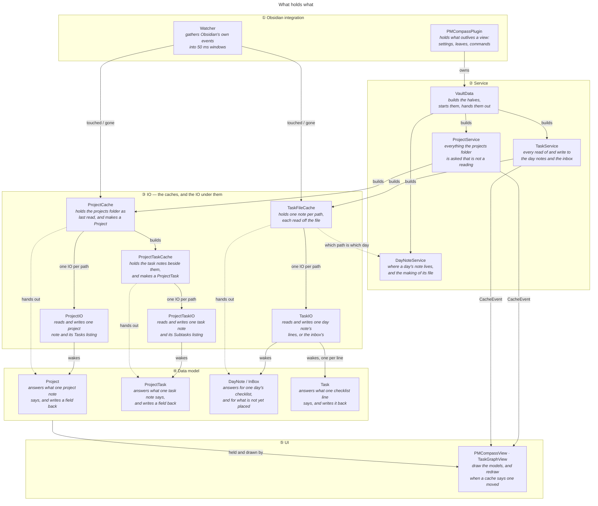
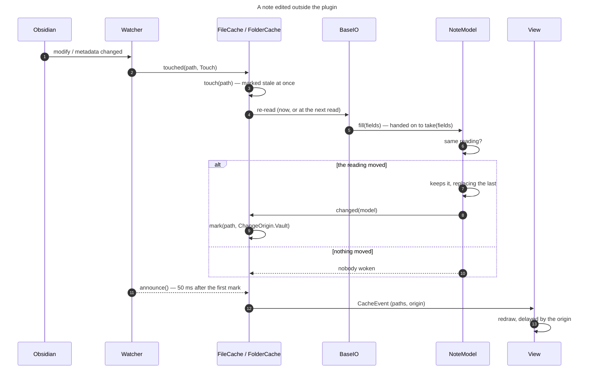
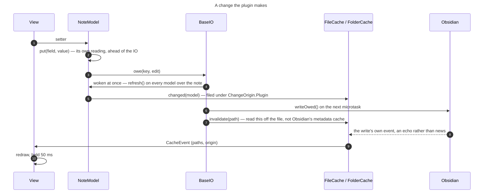
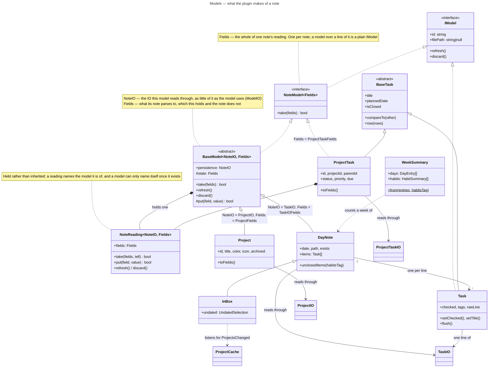
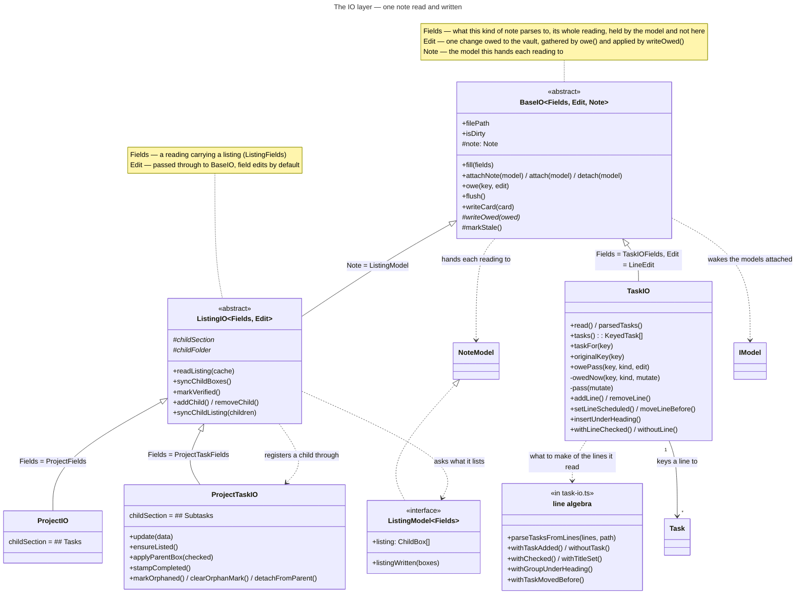
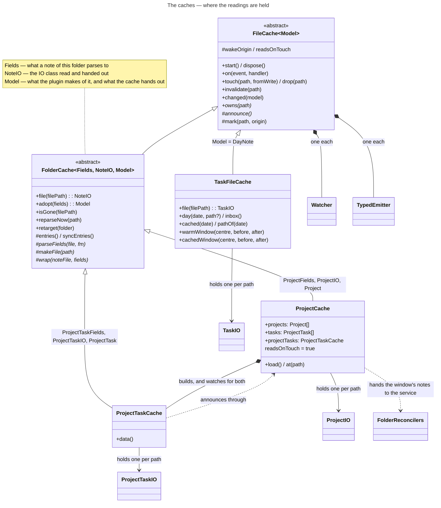
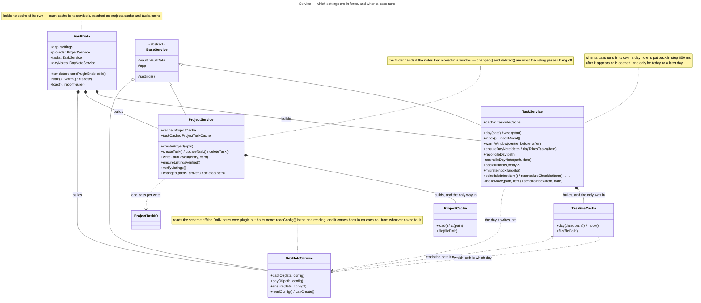
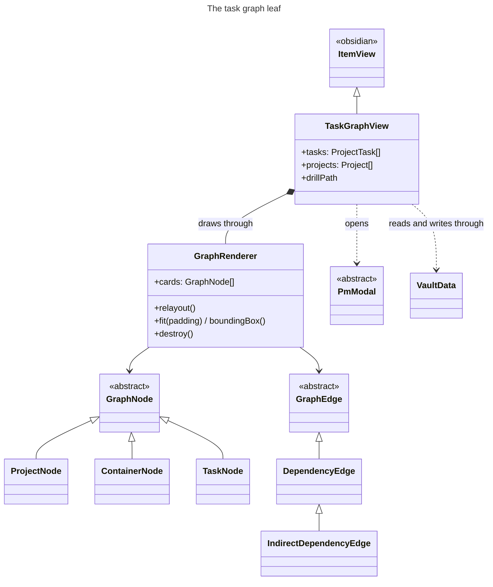
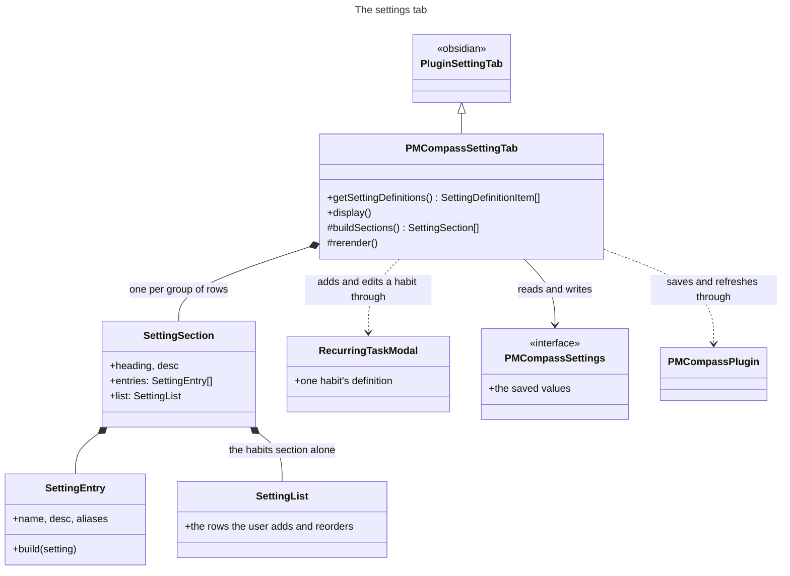

# Data model — the classes and what each is for

The plugin reads and writes ordinary markdown, and holds one live reading of every note it cares about. This document is what each class in that arrangement is responsible for, from the screen down to the file: the views, the models they draw, the IO under them, the services that hand the models out, and the watching that keeps all of it in step with the vault.

Diagrams in this document are also available in [class-map.html](class-map.html). They are generated — see [setup.md](setup.md#the-documentation-diagrams).

## How the layers fit

<!-- diagram:overview -->

<!-- /diagram -->

The names say the split: a **Project** is the project, a **ProjectIO** is the way its note is read and written. The IO reads the note and hands that reading to the model over it, which is where the data is kept, so what the plugin passes around is a live object rather than a copy that falls behind.

That gives one rule per layer.

- A [**view**](#the-views) draws the models it holds, and redraws when a cache says one of them moved. It never reads a note.
- A [**model**](#models) holds one note's reading and answers what a view draws from. It never touches the vault.
- An [**IO**](#the-io-layer) reads its note, writes what it is owed, and wakes the models over it. A change that touches this note alone is its own; it never decides what a change means beyond that.
- A [**cache**](#the-io-layer) says which paths are its own, when the re-read happens, and what a view is told. It never parses a note itself.
- A [**service**](#the-service-layer) holds which settings are in force, when a pass over the vault runs, and every write that spans two notes. It holds no reading.
- The [**watching**](#watching-and-events) gathers Obsidian's own events into windows and tells the caches which paths were touched. It decides nothing about what a change means either.

### The invariants

The rules above say what each layer does. These say what holds across them — each one is what some class refuses to do, and breaking one is what the arrangement is meant to make hard.

- **A model comes from a service.** Every [**Project**](#project--srcmodelprojectprojectts), [**ProjectTask**](#projecttask--srcmodelprojectproject-taskts), [**DayNote**](#daynote--srcmodeldailyday-notets) and [**Task**](#task--srcmodeldailytaskts) a view holds was handed to it by [**ProjectService**](#projectservice--srcmodelserviceproject-servicets) or [**TaskService**](#taskservice--srcmodelservicetask-servicets). Nothing above the model layer reaches a cache to get one.
- **A service owns its cache, and is the way to it.** [**ProjectCache**](#projectcache--srcmodelcacheproject-cachets) is reached as `projects.cache` and [**TaskFileCache**](#taskfilecache--srcmodelcachetask-file-cachets) as `tasks.cache`, each off the service that built it, which is also what fixes the folder it reads — [**VaultData**](#vaultdata--srcmodelservicevault-datats) holds neither.
- **One reading per path.** A cache holds one IO and one model per path, and hands back the same instance on every ask. A second would be a second answer to what the note says.
- **A model is made by its cache alone.** `new` on a model outside the cache that holds it produces one nothing will ever wake.
- **A vault event marks a path stale at once; only the telling is delayed.** The 50 ms window holds back what the views are told, not the marking — a read arriving inside it re-reads the paths marked stale before it answers, rather than handing back what the cache was holding.
- **A model owes its IO a change, it never writes one.** A setter says what the field or the line should now read as and hands the IO an edit; the IO gathers what it is owed and writes once, on the next microtask. Ten setters cost one pass over the note.
- **An IO that writes marks its own path stale.** Obsidian's metadata cache still holds what the note said before the write, so the IO tells its cache to re-read and the next reading is taken off disk.
- **A path is the IO layer's.** Above it, a note is named by the model standing for it. What crosses the boundary the other way — a vault event, the inbox's configured location — arrives as a path and is turned into a model at the edge.
- **Settings are read on each use.** No service, cache or IO keeps a copy.

### A change, end to end

Those rules meet in the round trip a change makes. It runs one way for an edit arriving from the vault and the other for one the plugin makes.

#### A note edited on disk

<!-- diagram:vault-change -->

<!-- /diagram -->

1. Obsidian reports the modification, or the change to its metadata cache that follows it.
2. Every cache — [**FileCache**](#filecachemodel--srcmodelcachefile-cachets) and [**FolderCache**](#foldercachefields-noteio-model--srcmodelcachefolder-cachets) alike — hears it, each through a [**Watcher**](#watcher--srcmodeliowatcherts) of its own, and keeps the path only if `owns()` claims it.
3. The cache marks that path stale on the spot — before anything is re-read, so a read arriving in the next millisecond can no longer be answered from what the cache holds.
4. The cache refreshes its copy of the note — cf. [`readsOnTouch`](#filecachemodel--srcmodelcachefile-cachets).
5. The [**IO**](#baseiofields-edit-note--srcmodeliobase-iots) parses the note and fills the [**models**](#notemodelfields--srcmodeli-modelts) over it.
6. Each compares the new reading against the one it holds — 7 if it moved, 10 if it didn't.
7. *It moved* — the model keeps the new reading, replacing the last.
8. It tells its cache it changed.
9. The cache records the path, with `ChangeOrigin.Vault`.
10. *Nothing moved* — the model says nothing, so the path is left out of the next telling and no view hears of it, which is what keeps a sync touching fifty notes from redrawing fifty times.
11. The marking at 9 opens a 50 ms window, the marks landing inside it joining the same telling — a burst that marked nothing opens none — and [**Watcher**](#watcher--srcmodeliowatcherts) calls `announce()` when it closes.
12. The cache emits one [`CacheEvent`](#cacheevent-and-changeorigin) carrying every path that moved and where the change came from.
13. The [**view**](#the-views) redraws from the models it already holds — it reads nothing. The redraw waits first, and each further event restarts that wait, so a note still being edited is drawn once it settles rather than rebuilt under the reader's hands. How long is how likely another edit is to follow: 2 s for a day note, the one a user types into with the dashboard beside it; 300 ms for a project note, edited a field at a time; 50 ms for the plugin's own write, which nothing more is coming after and someone is waiting on.

#### A change the plugin makes

<!-- diagram:plugin-change -->

<!-- /diagram -->

1. A [**view**](#the-views) calls a setter on a [**model**](#notemodelfields--srcmodeli-modelts).
2. The model puts the value into its own reading at once, so it is ahead of the IO.
3. It owes the [**IO**](#baseiofields-edit-note--srcmodeliobase-iots) the matching edit, keyed so that setting the same thing twice replaces it rather than queueing behind it.
4. The IO wakes every model over that note right away — a sibling holding another slice of it, one memoized on the old reading — so nothing over the note is left saying what it said before.
5. Each of them files itself with the cache, under `ChangeOrigin.Plugin`. Nothing is drawn here: the redraw is queued from the setter rather than from the write, which is why the screen never waits on the vault.
6. The write follows on the next microtask, everything owed in that turn in one pass over the note: ten setters cost one write.
7. Having written, the IO marks its own path stale, because Obsidian's metadata cache still holds what the note said before, and the next reading is taken off disk.
8. The vault event that write provokes lands moments later, and from here it is the first scenario again — steps 2 to 13, under `Plugin` rather than `Vault`. The read still owed on that path is what says it is this plugin's own edit echoing back rather than news from outside.
9. The cache emits its [`CacheEvent`](#cacheevent-and-changeorigin) as before.
10. The redraw is held 50 ms rather than seconds, and finds a reading that already matches what is on screen — often nothing moved at all, the models having been brought in step back at 4.

## Models

<!-- diagram:models -->

<!-- /diagram -->

### `IModel` — `src/model/i-model.ts`

**IModel** is responsible for taking a change to the data it holds:

- `refresh()` — that data has changed.
- `discard()` — that data is gone.

A model is identified by `id`, and by the `filePath` its data was read from — null for a model over nothing.

### `NoteModel<Fields>` — `src/model/i-model.ts`

*extends `IModel`*

**NoteModel** is responsible for holding the whole of one note's reading — the only place it is kept. `take(fields)` is all of it: what the note now reads as, and whether that moved anything a view would draw differently.

One per note. A day's checklist lines have models of their own, and those are plain [**IModel**](#imodel--srcmodeli-modelts)s: what each holds is a line, which its note hands it rather than the whole.

Its generic parameter `Fields` is what that kind of note parses to — [**BaseIO**](#baseiofields-edit-note--srcmodeliobase-iots)'s, from the other side.

### `BaseModel<NoteIO, Fields>` — `src/model/base-model.ts`

*abstract, implements `NoteModel`*

**BaseModel** is responsible for holding one note's reading and for announcing a change only when there is one:

- `take(fields)` keeps the reading whole and tells the cache when `sameFields()` says it moved.
- `put(field, value)` moves one field of it and tells nobody — what a subclass takes a write of its own back with, the vault already holding it.
- `discard()` detaches and announces the loss once, however often it is called.

The reading itself is held rather than inherited — a [**NoteReading**](#notereadingnoteio-fields--srcmodelbase-modelts), which is what those three calls go through.

Two generic parameters:

- `NoteIO` extends [**ModelIO**](#modelio--srcmodelbase-modelts) — the IO this model reads through.
- `Fields` — what its note parses to, which this holds and the IO does not.

> **Note:** [**ProjectTask**](#projecttask--srcmodelprojectproject-taskts) implements [**NoteModel**](#notemodelfields--srcmodeli-modelts) itself rather than extending this: it is a [**BaseTask**](#basetask--srcmodelbase-taskts) first, so that it can share a list with a day note's own lines, and a class has only one parent to spend.

### `NoteReading<NoteIO, Fields>` — `src/model/base-model.ts`

**NoteReading** is responsible for one note's reading and the keeping of it: the fields its IO last handed over, whether that note has gone, and the telling of both to the cache. `take(fields, tell)` keeps a fresh reading and says whether it moved, `tell` false keeping that to itself for a model that decides for itself when a move is worth announcing.

A reading names the model it is of — what the IO wakes and the cache hears about — and a model can only name itself once it exists, which is why this is held rather than inherited. [**BaseModel**](#basemodelnoteio-fields--srcmodelbase-modelts) holds one; so does [**ProjectTask**](#projecttask--srcmodelprojectproject-taskts).

Its generic parameters are [**BaseModel**](#basemodelnoteio-fields--srcmodelbase-modelts)'s.

### `ModelCache` — `src/model/base-model.ts`

**ModelCache** is responsible for collecting the changes models report — `changed(model)` — and passing them on to whoever listens. The IO layer listens to it, through [**FileCache**](#filecachemodel--srcmodelcachefile-cachets).

### `BaseTask` — `src/model/base-task.ts`

*abstract*

**BaseTask** holds the information every task — [**Task**](#task--srcmodeldailytaskts), [**ProjectTask**](#projecttask--srcmodelprojectproject-taskts) — needs to be rendered or sorted:

- its `title`, and the `rowTitle(habitsTag)` a row prints.
- its `statusValue` and the `statusScale` it can be set to, and `isClosed`.
- its `ownPriority`, and the `priorityInForce()` the tree around it makes.
- its dates — `plannedDate`, `ownDue`, `dueInForce()`, `createdOn`, `closedOn`.
- its `tagNames`, and where it sits: `filePath`, `fileLine`, and whether that file records the order it sits in — `keepsFileOrder`.
- `row(rows)`, which of the two rows a list draws it is: the arm naming this kind is called and what it makes handed back, rather than a list testing for the kind and casting on the answer.
- `compareTo(other, opts)`, which ranks on the `Status` and `Priority` enums declared here.

### `Task` — `src/model/daily/task.ts`

*extends `BaseTask`, implements `IModel`*

**Task** holds what one `- [ ] ` line says:

- its `title`, `checked` box and `tags`.
- its `priority`, off the marker the line carries — 🔺 critical, ⏫ high, 🔼 medium, 🔽 low, ⏬ lowest.
- its dates, likewise — ➕ `createdAt`, ⏳ `scheduledDate`, 🛫 `startDate`, 📅 `dueDate`, ✅ `completedAt`.
- the `rawLine` itself, its `lineIndex`, and the `subLines` indented under it.
- the note it came from: `filePath`, `noteDate`.

Identified by the key its line is filed under, a checklist line carrying no id.

It is made in two shapes:

- **bound**, by [**TaskIO**](#taskio--srcmodeliotask-iots) through `boundTo(note, key, cache, date)` — attached to that note, so a re-read wakes it. This is the live model a view holds. Its setters owe the note a `LineEdit`: what the change does to the note's own reading, and the pass that puts it on disk.
- **parsed**, by `parseTasksFromLines()` through `parse(line, index)` — a line turned into a task and nothing more: there is no note behind it, so nothing wakes it and its setters write nowhere. It is how the [line algebra](#the-line-algebra) *reads* a checklist — every task of a day, which lines are checked, which habits are already written down — and how `withoutTask()` hands a removed task back to its caller. Changing one line needs none of this: the edit already says which line it is.

### `ProjectTask` — `src/model/project/project-task.ts`

*extends `BaseTask`, implements `ListingModel<ProjectTaskFields>`*

**ProjectTask** holds what one obsidian-pm task note says:

- its `title`, `status`, `priority`, `type` and `progress`.
- its dates — `start`, `due`, `completed`, `createdAt`, `updatedAt`.
- its `tags` and `dependencies`.
- where it sits: `projectId`, `parentId`, and the `card` layout the graph left on it.
- `orphanedAt`, stamped when the opening pass finds that `parentId` naming nothing — see [task-listings.md](task-listings.md#tasks-whose-frontmatter-names-something-that-isnt-there).

Identified by the `id` its frontmatter carries. The getters read state taken from the note, the setters write through it. Which tasks are its children is no part of it: a caller with the folder's tasks in hand builds the tree with `buildChildMap()`.

**Made by** [**ProjectTaskCache**](#projecttaskcache--srcmodelcacheproject-task-cachets) alone (`wrap()` / `make()`).

### `Project` — `src/model/project/project.ts`

*extends `BaseModel<ProjectIO, ProjectFields>`, implements `ListingModel<ProjectFields>`*

**Project** holds what one project note says: its `title`, `color`, `icon`, `archived` flag and `card` layout. Identified by the `id` its frontmatter carries. Setting a field writes through the note. Which tasks it holds is no part of it: a caller with the folder's tasks in hand groups them by `projectId`.

**Made by** [**ProjectCache**](#projectcache--srcmodelcacheproject-cachets) alone.

### `DayNote` — `src/model/daily/day-note.ts`

*extends `BaseModel<TaskIO, TaskIOFields>`*

**DayNote** is responsible for one day's checklist, kept live: one [**Task**](#task--srcmodeldailytaskts) per line, matched across re-reads by the key that line is filed under, and the lines gained and lost between two readings. Identified by its date and the path of its note. `unclosedItems(habitsTag)` is what the day still has to do — its habits left out, a habit being the day's own routine coming back tomorrow rather than work it is carrying.

**Made by** [**TaskFileCache**](#taskfilecache--srcmodelcachetask-file-cachets) alone.

### `InBox` — `src/model/daily/inbox.ts`

*extends `DayNote`*

**InBox** is responsible for everything written down and not yet placed, which comes in two halves:

- its own note's lines, held as any day holds them.
- the project tasks carrying a priority but no date, which no dashboard horizon holds.

It picks that second half again on `ProjectsChanged`, and announces only when what it holds moved.

### `WeekSummary` — `src/model/daily/week-summary.ts`

**WeekSummary** is responsible for aggregating a week of days into per-day completion counts and per-habit grids. `WeekSummary.from(entries, habitsTag)` builds one from the seven days it is handed and counts them there and then — the constructor is private, so there is no half-filled summary to fill in afterwards, and no reading of its own to keep current.

### `frontmatter.ts` — `src/model/project/frontmatter.ts`

The **frontmatter module** is responsible for what a project or task note's frontmatter is made of, on both sides of the file:

- `Frontmatter` — the keys obsidian-pm writes, as an enum. The one place a key's spelling lives, the notes themselves keeping the exact strings they always had.
- `frontmatterDay()` / `frontmatterTimestamp()` / `stringArray()` / `asFrontmatterRecord()` — what an unknown value read off a note narrows to. Every field is read through one of these: frontmatter arrives as whatever YAML made of it, and obsidian-pm's notes are hand-edited, so nothing is trusted to be what it should be.
- `touch(fm)` — stamps `updatedAt`, which every write of a note's own fields ends with. Where a card was left is not such a write, and doesn't: nudging the drawing must not move a note up a list sorted by it.
- `splitFrontmatterBody(raw)` — a file as its frontmatter block and the rest, which is how the body's `Project:` / `Parent:` prefix and description are reached without reparsing the YAML.

It is a module rather than a class: there is no per-note state here, only what a key is called and what its value reads as. Paths and the files at them are the other half of the same plumbing, and live in [file-helpers.ts](#file-helpersts--srcmodelfile-helpersts) below — which names nothing of this plugin's own, where this names only that.

### `file-helpers.ts` — `src/model/file-helpers.ts`

The **file-helpers module** is responsible for paths and the files at them, which is all it is: resolving a path to its file, creating a folder with its missing ancestors, and making a free path to put a note at.

- `resolveFile(app, path)` — a vault-relative path as its `TFile`, null for one that isn't a file.
- `ensureFolderRecursive(app, folder)` — the folder with its missing ancestors, created when absent. A folder that turned up while the walk ran counts as success.
- `uniquePathIn(app, folder, title, untitled, taken?)` — a free path for a note called `title`. `untitled` names what the note *is* — `"task"`, `"project"` — for a title written in characters no slug survives. `taken` reserves paths not on disk yet, so a subtree moving whole allocates every destination up front and two moving siblings can't both claim one.
- `basenameOf()` / `parentDirOf()` / `generateId()` — what a path is made of, and the id a new note carries.

Nothing here belongs to one caller: every entry is reached from the models, the IO and the services alike, and the module names nothing of this plugin's own — a path is a path whichever kind of note sits at it. What one part alone uses lives with that part: the file lock and a note's lines with [**TaskIO**](#taskio--srcmodeliotask-iots), which owns the path; the body prefix with [**ProjectTaskIO**](#projecttaskio--srcmodelioproject-task-iots), which writes it; what a note's frontmatter reads as with [frontmatter.ts](#frontmatterts--srcmodelprojectfrontmatterts), where the keys already live; and the making of a particular note with the service that owns it — the inbox's with [**TaskService**](#taskservice--srcmodelservicetask-servicets), a day's with [**DayNoteService**](#daynoteservice--srcmodelserviceday-note-servicets).

No view reaches into it for a write. A tab that needs a note made asks the service that owns it — see `TaskService.ensureInboxNote`.

## The IO layer

Two halves. An **IO** reads and writes one note and hands each reading to the model over it; a **cache** holds one IO and one model per path, says which paths are its own, and decides when a re-read happens. Nothing above this layer opens a note.

<!-- diagram:io -->

<!-- /diagram -->

### `BaseIO<Fields, Edit, Note>` — `src/model/io/base-io.ts`

*abstract*

**BaseIO** is responsible for the IO over one note. Identified by its path, one IO per path. It parses nothing, holds none of what the note says, and decides nothing about what a change means:

- it hands each fresh reading to the model over the note.
- it turns a change into a write.

Three generic parameters:

- `Fields` extends `FileFields` — what this kind of note parses to, its whole reading: `ProjectFields` for a project, `TaskIOFields` for a day.
- `Edit`, `FieldEdit<Fields>` by default — what one change owed to the vault looks like: the field edit a frontmatter note owes as a model sets one, or a kind of the IO's own, which is [**TaskIO**](#taskio--srcmodeliotask-iots)'s `LineEdit` over the lines of a checklist.
- `Note` extends [**NoteModel**](#notemodelfields--srcmodeli-modelts), and is that by default — the model this hands its readings to. [**ListingIO**](#listingiofields-edit--srcmodeliolisting-iots) binds it to [**ListingModel**](#listingmodelfields--srcmodeliolisting-iots), asking more of the model than an IO without a listing does.

Reading: `fill(fields)` hands the whole reading, listing included, to the note's model, which is where the last one is kept and so what says whether this one moved. `attachNote(model)` registers that one model, against the `attach(model)` a model holding a slice of the note uses. An IO with no model yet takes nothing: a reading with nothing to hold it is a reading nobody asked for.

`writeCard(card)` is the one write that doesn't go through `owe()`: where the note's card was left in the graph, stamping no `updatedAt` — nudging the drawing must not move a note up a list sorted by it. Taking that onto the reading is the model's, in `moveCard()`.

Writing: `owe(key, edit)` gathers a change under a key, wakes the models at once so what they say is never behind the IO, and writes on the next microtask through the subclass's `writeOwed()` — which is handed everything owed together, one pass over the note being what a subclass owes the vault. Passes are chained so two never interleave, and `saved` / `isDirty` say where the vault stands against the reading.

`markStale()` is the other half of a write: the note asks the cache that made it for a re-read, before the write and again once it lands. The cache comes in on the constructor as a `NoteCache` — the one method a note needs of it — so which cache announces a path stays the cache's own business.

### `ModelIO` — `src/model/base-model.ts`

**ModelIO** is responsible for answering what a model asks of the IO it reads through:

- `filePath` — where that note's data was read from.
- `attachNote(model)` / `detach(model)` — to be handed that IO's readings from now on, or to stop being.
- `flush()` — everything set on it, on the vault now.

It is all a model ever asks of an IO, and [**BaseIO**](#baseiofields-edit-note--srcmodeliobase-iots) answers it. Declared over in the model layer so a model names no class of this one.

### `ListingIO<Fields, Edit>` — `src/model/io/listing-io.ts`

*extends `BaseIO`*

**ListingIO** is responsible for the `- [ ] [[child]]` checklist a project note or a task note carries below it — a project's `## Tasks`, a task's `## Subtasks`:

- reading the list, as part of the note's reading.
- adding an entry, dropping one, and rewriting a line.
- keeping the boxes and the tasks they name in step.

> **Note:** [**ProjectIO**](#projectio--srcmodelioproject-iots) and [**ProjectTaskIO**](#projecttaskio--srcmodelioproject-task-iots) answer only which section holds the list (`childSection`) and where the children's notes sit (`childFolder`). A day note lists nothing, and is a [**BaseIO**](#baseiofields-edit-note--srcmodeliobase-iots).

Its two generic parameters are [**BaseIO**](#baseiofields-edit-note--srcmodeliobase-iots)'s: `Fields` extends `ListingFields`, so that the reading carries a listing, and `Edit` passes straight through — both subclasses leave it at the field edits a frontmatter note owes.

### `ListingModel<Fields>` — `src/model/io/listing-io.ts`

*extends `NoteModel`*

**ListingModel** is responsible for answering the two things a listing note's IO asks of the model over it, a listing being part of what that note reads as:

- `listing` — the boxes it lists, as last read or written.
- `listingWritten(boxes)` — the listing its note has just written, taken onto the reading and told to nobody.

[**Project**](#project--srcmodelprojectprojectts) and [**ProjectTask**](#projecttask--srcmodelprojectproject-taskts) answer it. It is what [**ListingIO**](#listingiofields-edit--srcmodeliolisting-iots) binds [**BaseIO**](#baseiofields-edit-note--srcmodeliobase-iots)'s `Note` to, so an IO about to rewrite a listing can ask what it currently says without naming a model class.

`syncChildBoxes()` is the one way into the reconciling, choosing between `applyChildBoxes()` and `repairChildBoxes()` by the standing a private `verified` flag holds, which `markVerified()` sets — [the verification problem](task-listings.md#the-verification-problem) is what that standing decides. The flag stays outside the reading: a note whose standing changed hasn't moved as far as a view is concerned, so it takes no part in `sameFields()`. Every write goes out through this class, so the listing it left comes back onto the note's own reading — `listingWritten()` on the model, which tells nobody.

### `ProjectIO` — `src/model/io/project-io.ts`

*extends `ListingIO<ProjectFields>`*

**ProjectIO** is responsible for the IO over one project note: its frontmatter as last read, the typed writes onto it, and its `## Tasks` list of root-level tasks. Nested tasks belong to their parent task's listing, not here.

**Made by** [**ProjectCache**](#projectcache--srcmodelcacheproject-cachets) alone; `vault.projects.cache.file(path)` is how everything else gets one.

### `ProjectTaskIO` — `src/model/io/project-task-io.ts`

*extends `ListingIO<ProjectTaskFields>`*

**ProjectTaskIO** is responsible for the IO over one task note:

- its frontmatter, and its body — the description, and the `Project:` / `Parent:` prefix naming where it is listed.
- its `## Subtasks` list.
- both [directions](task-listings.md#the-synchronization-mechanism) of keeping it and its parent's listing in step: `pushToListing()` puts its title and box onto the line that names it, `applyParentBox()` closes or reopens it to match its box.
- `ensureListed()`, for a task note nothing lists yet.
- `stampCompleted()` / `needsCompletedStamp()`, which put the `completed` date on a task closed anywhere else.
- `markOrphaned()` / `clearOrphanMark()` / `detachFromParent()`, the [opening pass](task-listings.md#tasks-whose-frontmatter-names-something-that-isnt-there)'s three answers to a `parentId` that names nothing. Each writes only where the file still reads as what the walk was told, a note having had a whole folder's worth of reading to change under it.

**Made by** [**ProjectTaskCache**](#projecttaskcache--srcmodelcacheproject-task-cachets) alone.

### `TaskIO` — `src/model/io/task-io.ts`

*extends `BaseIO<TaskIOFields, LineEdit>`*

**TaskIO** is responsible for the IO over one day note, or the inbox: its lines as last read, and the checklist lines they parse to. The note being a list rather than a set of fields, it also answers for:

- keying every line — the title, plus which occurrence of that title it is.
- waking only the models whose line moved.
- following a line through a rename it wrote, rather than reporting one gone and another arrived.

Its edits are changes to lines rather than field writes (`LineEdit`). Each carries two halves: `ahead`, which puts the change on this IO's own line so the models are never behind the vault, and `apply(file, lines)`, which answers what those lines should read as. Answered rather than written, because `writeOwed()` runs the lot in one pass: one lock, one reading, one write, each change resolving its line afresh in the lines the one before it left. Some of what is owed only makes sense whole — the habits a day is due come as the lines to drop and the section to put back — and a note caught between the two reads as a note missing its habits, which whatever reads it next would set about putting right.

The pass itself is `pass(mutate)`, and the lock it takes is this IO's own: the one lock over a path, beside the reading and the writing it guards. It reads the lines off the file rather than off the ones [**DayNote**](#daynote--srcmodeldailyday-notets) holds, which are only what the cache last read — a day note is a file a human types into and a sync rewrites. What to make of those lines is the [line algebra](#the-line-algebra)'s, which is pure; one method here pairs with each of its functions, and there is no way in but through one of them.

A change comes in either of two shapes. `withLineChecked(lines, at, date)` only says what the lines become, which is what a model's setter owes and doesn't wait on; `setLineScheduled(at, date)` owes the change and waits for it, reporting what the pass found — for a caller with something to do with the answer.

Every write is owed, whichever of the two it came from: `owedNow()` is what the methods above are built on, and it goes through `owePass()` like any line edit. So there is one way a day note changes, and one place a re-read is marked — the note itself, in `markStale()`.

A change that is nobody's line to set is owed the same as a change a model holds. `reconcileHabits()` is one of them and lives here, being one note's: the lines the definitions no longer call for taken out and the section put back, keyed on the heading rather than on a line, since the section is what changes. A change that touches a second note is [**TaskService**](#taskservice--srcmodelservicetask-servicets)'s instead: it holds the cache, so it asks it for each note it touches.

**Made by** [**TaskFileCache**](#taskfilecache--srcmodelcachetask-file-cachets) alone.

### The line algebra

*the foot of `src/model/io/task-io.ts`*

The **line algebra** is responsible for what a checklist reads as and what it should read as next: `parseTasksFromLines()` behind every read, and `withTaskAdded()`, `withoutTask()`, `withoutCheckedTasks()`, `withChecked()`, `withTitleSet()`, `withPrioritySet()`, `withScheduledDateSet()`, `withSubLinesSet()`, `withTaskMovedBefore()` and `withGroupUnderHeading()` behind the writes. Each is a pure function of the lines it is handed and answers a `LinePass` — the lines to write back, null writing nothing so a change that changes nothing leaves the views alone, and what the pass has to report.

It lives below the class rather than in a module of its own: the guarded read-modify-write it runs inside is [**TaskIO**](#taskio--srcmodeliotask-iots)'s, and nothing else has a use for it. Only what is needed from outside is exported — `parseTasksFromLines()`; the rest is the class's own, reached through the method that pairs with it.

The caches over them, and who watches the vault on their behalf:

<!-- diagram:caches -->

<!-- /diagram -->

### `FileCache<Model>` — `src/model/cache/file-cache.ts`

*abstract*

**FileCache** is responsible for one part of the vault, held one entry per note path: marking which entries have changed since they were last parsed, watching the vault through its own [**Watcher**](#watcher--srcmodeliowatcherts), and announcing through its own [**TypedEmitter**](#typedemitterevents--srcmodelcachecache-eventsts). A subclass answers:

- `owns(path)` — which paths are its own.
- `announce()` — what to tell the views when a window closes.
- `created()` / `reparsed()` / `deleted()` — what an arrival, a re-parse and a deletion cost.

Its generic parameter `Model` is what it holds one of per path — what a note of this part of the vault reads as, and so what is handed out.

Of the notes `owns()` claims, it keeps track of which have gone stale and reads them on demand, unless `readsOnTouch` says otherwise:

- `readsOnTouch` **true** — the note is read as the event lands, and the models over it report the change. A note that turns out to say what the cache already held reaches no view. [**ProjectCache**](#projectcache--srcmodelcacheproject-cachets) works this way.
- `readsOnTouch` **false**, the default — the path is reported changed as the event lands, and the note read when something — a view for instance — next asks for it. Cheaper, and noisier — it announces without knowing yet whether anything changed. [**TaskFileCache**](#taskfilecache--srcmodelcachetask-file-cachets) works this way.

### `FolderCache<Fields, NoteIO, Model>` — `src/model/cache/folder-cache.ts`

*abstract, extends `FileCache`*

**FolderCache** is responsible for one kind of note under a folder, and for everything held per path:

- which files under it are worth opening.
- the IO — `file(path)`, made once and kept, so a path has one reading.
- the model over it — `wrap()`.
- the folder as a whole — `entries()`, memoized until something changes.
- whether a note has gone — `isGone(filePath)`, asked of the vault rather than of the reading, a note missing from the folder's last reading being no more than a note it hasn't caught up with. A caller that went to the vault itself would be deciding for the cache what its own lag means.
- a note just written — `adopt(fields)`, which builds the model over what was written rather than reading it back, and marks the path so the folder's own reading holds it too. What a caller that has made a note gets its model from, before Obsidian has parsed the file.

Nothing outside it makes an IO or a model.

Three generic parameters, one per layer it joins:

- `Fields` extends `ListingFields` — what a note of its folder parses to.
- `NoteIO` extends [**ListingIO**](#listingiofields-edit--srcmodeliolisting-iots) — the IO class it makes and hands out.
- `Model` extends `CachedModel` — what the plugin makes of that note, which is [**FileCache**](#filecachemodel--srcmodelcachefile-cachets)'s parameter and what a view ends up holding.

### `ProjectCache` — `src/model/cache/project-cache.ts`

*extends `FolderCache<ProjectFields, ProjectIO, Project>`*

**ProjectCache** is responsible for the projects folder as it was last read, and the only maker of a [**Project**](#project--srcmodelprojectprojectts) and a [**ProjectIO**](#projectio--srcmodelioproject-iots). It reads the folder in two passes — projects first — so a task's `projectId` names a project already read, and does the watching for **both** halves: [**ProjectTaskCache**](#projecttaskcache--srcmodelcacheproject-task-cachets) announces through it.

What a window of changes then costs the listings is [**ProjectService**](#projectservice--srcmodelserviceproject-servicets)'s. This cache hands it what only a cache knows — the notes whose models actually woke, and which of them the folder didn't hold before — through the `FolderReconcilers` calls it is built with.

### `ProjectTaskCache` — `src/model/cache/project-task-cache.ts`

*extends `FolderCache<ProjectTaskFields, ProjectTaskIO, ProjectTask>`*

**ProjectTaskCache** is responsible for the task notes beside the projects, and the only maker of a [**ProjectTask**](#projecttask--srcmodelprojectproject-taskts) and a [**ProjectTaskIO**](#projecttaskio--srcmodelioproject-task-iots). It claims the notes [**ProjectCache**](#projectcache--srcmodelcacheproject-cachets) does not. Creating, updating and deleting a task note are [**ProjectService**](#projectservice--srcmodelserviceproject-servicets)'s: each writes a second note's listing too.

### `TaskFileCache` — `src/model/cache/task-file-cache.ts`

*extends `FileCache<DayNote>`*

**TaskFileCache** is responsible for the day notes and the inbox, one note per path, and the only maker of a [**TaskIO**](#taskio--srcmodeliotask-iots), a [**DayNote**](#daynote--srcmodeldailyday-notets) and an [**InBox**](#inbox--srcmodeldailyinboxts). Every reading is taken off the file rather than the metadata cache, and it reads what is there rather than making it — a day's note comes into being through [**DayNoteService**](#daynoteservice--srcmodelserviceday-note-servicets)`.ensure()`, which reads it back through here. The habit reconcile runs on a day note *created*, never on one changing, so a note being typed into is not rewritten under the cursor.

- `day(date, filePath?)` — the day's note, off `filePath` when it doesn't sit where the naming scheme says.
- `inbox()` — the inbox, its checked lines pruned as it reads.
- `warmWindow()` / `cachedWindow()` — the days either side of one on show, read a few at a time and told about as each lands.

## The service layer

Above the caches, and holding no reading of its own: which settings are in force, and when a pass runs. A write from a view enters here and runs as one pass over the vault.

Both halves of the vault are built alike — a cache under a service. [**TaskFileCache**](#taskfilecache--srcmodelcachetask-file-cachets) under [**TaskService**](#taskservice--srcmodelservicetask-servicets) for the days; [**ProjectCache**](#projectcache--srcmodelcacheproject-cachets) and [**ProjectTaskCache**](#projecttaskcache--srcmodelcacheproject-task-cachets) under [**ProjectService**](#projectservice--srcmodelserviceproject-servicets) for the folder. One service over both project caches rather than one each: creating a task writes the task note *and* the listing of whatever holds it, so those writes cross the halves already. Beside the two, and cache-less, [**DayNoteService**](#daynoteservice--srcmodelserviceday-note-servicets): where a day's note lives and how one comes into being, which both halves and the passes between them ask.

<!-- diagram:service -->

<!-- /diagram -->

### `BaseService` — `src/model/service/base-service.ts`

**BaseService** is responsible for what a service has of its own: the [**VaultData**](#vaultdata--srcmodelservicevault-datats) it works on, and through it the app and the settings as they now stand. Read on each use rather than kept, so a service never answers with what the settings said when it was built.

### `DayNoteService` — `src/model/service/day-note-service.ts`

*extends `BaseService`*

**DayNoteService** is responsible for where a day's note lives under the daily-notes naming scheme, and for making one that isn't there yet:

- `pathOf(date, config)` — the path a day has, whether or not the file exists.
- `dayOf(path, config)` — the date that path stands for, or null when its name is not a day's.
- `ensure(date, config?)` — that day's note, its file created through Templater when the vault has it, and its folders with it.
- `readConfig()` — the scheme itself, off the Daily notes core plugin's own config file, and this plugin's guess when there is none to read.
- `canCreate()` — whether a note may be made at all.

`ensure()` is the one way a day note comes into being, and it hands back a [**DayNote**](#daynote--srcmodeldailyday-notets) rather than a path: a model is a service's to give out. Making the file is this class's; reading it is [**TaskFileCache**](#taskfilecache--srcmodelcachetask-file-cachets)'s, which alone may build one — reached, as every cache is, through the service that owns it. The note is read off the path the making came back with, not off `pathOf()`, Templater being free to land the file elsewhere; and a file that has just appeared is marked first, nothing having held it to say that it did. A pass that only needs somewhere to write a line takes the path off the note.

A null is a silent refusal — the vault says nowhere to put a note — so a caller moving a line into that note asks for it *before* touching the source, or the line is lost. What `canCreate()` answers is where that refusal comes from: with the core plugin off and no config it left behind, the folder and format are a guess, and a note made from a guess lands where nobody asked for it. Reading the day notes already there stays fine either way.

The scheme comes in on each call rather than being held, `readConfig()` being what a caller reads it with: who has it in hand already differs by caller — [**TaskFileCache**](#taskfilecache--srcmodelcachetask-file-cachets) and [**TaskService**](#taskservice--srcmodelservicetask-servicets) both keep the one in force. `DailyNotesConfig`, the scheme's three fields, is declared here beside the reading of it.

### `TaskService` — `src/model/service/task-service.ts`

*extends `BaseService`*

**TaskService** is responsible for every read of and write to the day notes and the inbox — nothing outside reaches past it:

- the reads — `day()`, `week()`, `inbox()`, `warmWindow()`, `daysCached()`.
- asking for today's note to be made when a read wants that day, and never for another: reading ahead must not litter the vault with empty notes. A day already held is not asked for again either — the read has seen the file, and asking would mark it for a re-read on every render.
- every write over a checklist — add, close, retitle, reprioritise, reschedule, reorder, move to the inbox, delete. Each takes the task and nothing else: which note a line is in is the line's to say, and a line no note holds throws rather than quietly never landing.
- moving a line between two notes, target-first: the note is made, the line put in, and only then taken out of the note it came from, so a failure part-way leaves the item in both places rather than in neither. What goes in is the source note's own reading of the line, a caller's copy saying nothing certain about the block under it.
- `promoteChecklistItem()`, which turns a line into a project task: its metadata translated across the two models, the task written through [**ProjectService**](#projectservice--srcmodelserviceproject-servicets) — a new project made first when that is the destination — and the line dropped last, so a crash mid-way leaves a visible duplicate rather than losing the item.
- whether a day takes tasks yet — `dayTakesTasks()`, true for today and for any day that already has a note, so planning ahead conjures no string of empty notes. A day that doesn't leaves the task in the inbox under a ⏳, which `ScheduleOutcome` is what reports.
- where the inbox note lives and the making of it — `inboxPath` and `ensureInboxNote()`. An inbox nothing has ever been added to has no file, so the Inbox tab's link to it asks for one here rather than creating a note itself; a view opens files and never makes them.
- `migrateInboxTargets()`, which moves every inbox item whose ⏳ target day now takes tasks into that day's checklist — what makes a target date a plan rather than a label.
- when a day note is put back in step — debounced 800 ms, and only for **today or a later day**, so reopening an older note doesn't rewrite it. `reconcileDayNote()` is the pass: the habits, for today and the rest of this week only, then the inbox migration whatever the day, a note appearing being what makes the pass worth running.
- when the week ahead is given its habits — `backfillHabits()`, which gives today and the rest of the ISO week the habit lines their definitions call for, each day's note made if it isn't there. A day already past is left alone, a habit changed mid-week not being licence to rewrite it. The days go concurrently, one file each, so their shared parent folder is made once up front rather than raced for — and not at all when no note may be made anyway.

`on()` passes through to [**TaskFileCache**](#taskfilecache--srcmodelcachetask-file-cachets), as does the reading of a window of days — what is here is the wait on the daily-notes scheme, without which the window would be read under the plugin's guess at it.

### `ProjectService` — `src/model/service/project-service.ts`

*extends `BaseService`, implements `FolderReconcilers`*

**ProjectService** is responsible for everything the projects folder is asked for that is not a reading, and for the cache it is read through — it builds [**ProjectCache**](#projectcache--srcmodelcacheproject-cachets) and hands it out as `cache`, the task notes beside it as `taskCache`:

- creating a project note, and creating, updating or deleting a task note — each of which writes the listing of whatever holds it as well.
- `writeCardLayout()`, for a project or a task alike.
- keeping the listings honest: `changed()` note by note as a window of edits lands, `ensureListingsVerified()` once a session, and `deleted()` for a note that has gone.

`on()` passes through to [**ProjectCache**](#projectcache--srcmodelcacheproject-cachets), so a view subscribes here for the folder's changes.

### `VaultData` — `src/model/service/vault-data.ts`

**VaultData** is responsible for everything the plugin holds: the way into the projects folder as `projects`, the day notes and the inbox as `tasks`, and where a day's note lives as `dayNotes`. It builds the three of them, starts them together and hands them out. No cache is held here — each is its service's, reached as `projects.cache` and `tasks.cache`. Every one of them holds it back, which is how an IO of one kind reaches an IO of another. It is also the one place that reaches for the plugins around this one — Templater as `templater`, Obsidian's own as `corePluginEnabled(id)` — so no pass has to cast the app to read a registry its published types leave out.

- `start()` begins the watching, in `onload()` — nothing that changes from that moment is missed.
- `warm()` waits for `onLayoutReady()`, then loads the folder and starts the [listing pass](task-listings.md#the-opening-pass).
- `load()` reads the folder, both halves of it, and hands back [**ProjectCache**](#projectcache--srcmodelcacheproject-cachets)'s own reading.

It is built as a field of [**PMCompassPlugin**](../../src/main.ts), so a view constructed from a restored layout always finds it.

## Watching and events

### `Watcher` — `src/model/io/watcher.ts`

**Watcher** is responsible for hearing the vault: Obsidian's five create / modify / delete / rename / metadata subscriptions, gathered by its [**Coalescer**](../../src/model/io/watcher.ts) into 50 ms windows and reported as a path and a `Touch`.

- `Written` — a write landed, Obsidian's own reading a step behind.
- `Reparsed` — the metadata cache is current.
- `Created` — a note the vault didn't hold a moment ago.

### `TypedEmitter<Events>` — `src/model/cache/cache-events.ts`

**TypedEmitter** is responsible for the subscriber list of one cache, one list per event. Subscribing hands back the unsubscribe rather than an `EventRef`; a handler that throws is logged and stepped over.

Its generic parameter `Events` is the map of event name to payload it carries: every cache holds a `TypedEmitter<CacheEvents>`.

### `CacheEvent` and `ChangeOrigin`

`ProjectsChanged` is [**ProjectCache**](#projectcache--srcmodelcacheproject-cachets)'s, handed on by [**ProjectService**](#projectservice--srcmodelserviceproject-servicets); the rest are [**TaskFileCache**](#taskfilecache--srcmodelcachetask-file-cachets)'s, which [**TaskService**](#taskservice--srcmodelservicetask-servicets) hands on.

| Event | Payload | Emitted by | Heard by |
| --- | --- | --- | --- |
| `ProjectsChanged` | `{ paths, origin }` | [**ProjectCache**](#projectcache--srcmodelcacheproject-cachets)`.announce()` | [**PMCompassView**](../../src/ui/pm-compass-view.ts), [**TaskGraphView**](../../src/ui/task-graph-view.ts), [**InBox**](#inbox--srcmodeldailyinboxts) |
| `DaysChanged` | `{ paths, origin }` | [**TaskFileCache**](#taskfilecache--srcmodelcachetask-file-cachets)`.announce()` | [**PMCompassView**](../../src/ui/pm-compass-view.ts) |
| `InboxChanged` | `{ path }` | [**TaskFileCache**](#taskfilecache--srcmodelcachetask-file-cachets)`.announce()` | [**PMCompassView**](../../src/ui/pm-compass-view.ts) |
| `DayWarmed` | `WarmedDay` | [**TaskFileCache**](#taskfilecache--srcmodelcachetask-file-cachets)`.warmWindow()` | [**DashboardView**](../../src/ui/dashboard-view.ts) |
| `WarmupFinished` | `{ days }` | [**TaskFileCache**](#taskfilecache--srcmodelcachetask-file-cachets)`.warmWindow()` | — |

`ChangeOrigin` says how soon a view should redraw:

- `Vault` — an edit from outside: a note being typed into, a sync landing.
- `Plugin` — a write of the plugin's own, which the view that asked for it is waiting on.

A window carrying both is told under `Vault`.

## The views

The plugin puts two leaves in the workspace and one tab in the settings, and each is drawn below on its own.

[**PMCompassPlugin**](../../src/main.ts) — what Obsidian loads. It is responsible for everything that outlives a view: the settings, the [**VaultData**](#vaultdata--srcmodelservicevault-datats) both leaves read through, the leaf types and the settings tab, and the four commands (open either leaf, backfill habits, repair listings).

### The dashboard leaf

<!-- diagram:ui-dashboard -->

<!-- /diagram -->

- [**PMCompassView**](../../src/ui/pm-compass-view.ts) — the "PM Dashboard" leaf. It is responsible for which tab is mounted, and for when the leaf redraws. It keeps one long-lived instance of each tab, so a tab's state survives being switched away from; it holds the redraw debounce, whose delay follows the `ChangeOrigin` of what changed; and it holds an [**OffscreenRefreshGate**](../../src/ui/offscreen-refresh-gate.ts), so a tab that is off screen redraws when it comes back rather than while it is away.
- [**BaseTabView**](../../src/ui/base-tab-view.ts) — it is responsible for everything the three tabs have in common: collapsible sections, the row skeleton every row is drawn on and the project-task row itself, the bar a tab steps its period on, the context menu, the promote-to-project-task flow, and which note panels stand expanded.
- [**DashboardView**](../../src/ui/dashboard-view.ts), [**InboxView**](../../src/ui/inbox-view.ts), [**WeekSummaryView**](../../src/ui/week-summary-view.ts) — the three tabs, each responsible for what its own screen shows and nothing else. Documented from a user's side in [dashboard.md](../guide/dashboard.md), [inbox.md](../guide/inbox.md) and [week-summary.md](../guide/week-summary.md).
- [**TaskList**](../../src/ui/task-list.ts) — the `<ul>` a list of tasks is made of. It is responsible only for where a row goes among the [**BaseTask**](#basetask--srcmodelbase-taskts)s it holds: the order, the drag-to-reorder the rows of one note share, and `insertSorted()`, which drops a row into a drawn list without rebuilding it. What a row contains is the tab's.
- [**PmModal**](../../src/ui/pm-modal.ts) — it is responsible for everything a dialog does the same way: the confirm/cancel footer, the shortcuts and the closing, so [**ConfirmModal**](../../src/ui/task-creator.ts), [**TaskModal**](../../src/ui/task-creator.ts), [**ProjectModal**](../../src/ui/task-creator.ts), [**RecurringTaskModal**](../../src/ui/recurring-task-modal.ts) and [**MoveTargetModal**](../../src/ui/move-target-modal.ts) each answer only for their own body.

### The task graph leaf

<!-- diagram:ui-graph -->

<!-- /diagram -->

- [**TaskGraphView**](../../src/ui/task-graph-view.ts) — the "Task Graph" leaf. It is responsible for what the graph holds — every task and project as a dependency graph — and for what the user does to it: drilling down, dragging a card, drawing a dependency. Where it is drawn is [**GraphRenderer**](../../src/ui/graph-renderer.ts)'s, and how one card or one link draws itself belongs to the [**GraphNode**](../../src/ui/graph-node.ts) and [**GraphEdge**](../../src/ui/graph-edge.ts) families. See [graph-display.md](../guide/graph-display.md).
- [**GraphRenderer**](../../src/ui/graph-renderer.ts) — it is responsible for drawing the nodes and edges it is handed: placing them (`layoutGraph()` unless the caller says otherwise, then whatever positions were stored against a card), panning and fitting, and turning a point on the page into the card under it. The plugin draws its own graph rather than through a graph library, and this is where that lives.

### The settings tab

<!-- diagram:ui-settings -->

<!-- /diagram -->

- [**PMCompassSettingTab**](../../src/ui/settings-tab.ts) — the settings screen. It is responsible for describing itself as sections of entries rather than drawing row by row, and answers both ways Obsidian asks for them: `getSettingDefinitions()` hands the description over on 1.13+, and `display()` draws the same sections itself on 1.12.x. Saving a value and telling the views to redraw goes through [**PMCompassPlugin**](../../src/main.ts). See [settings.md](settings.md).
