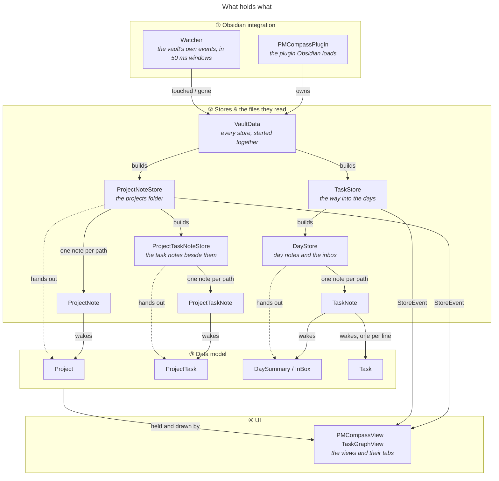
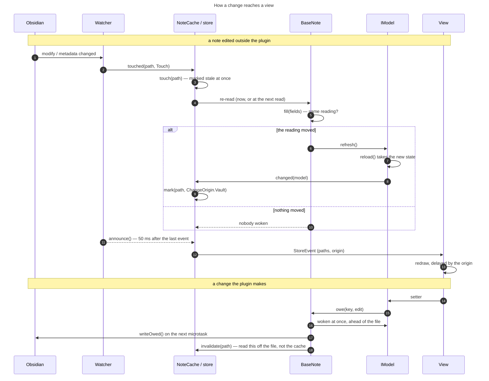
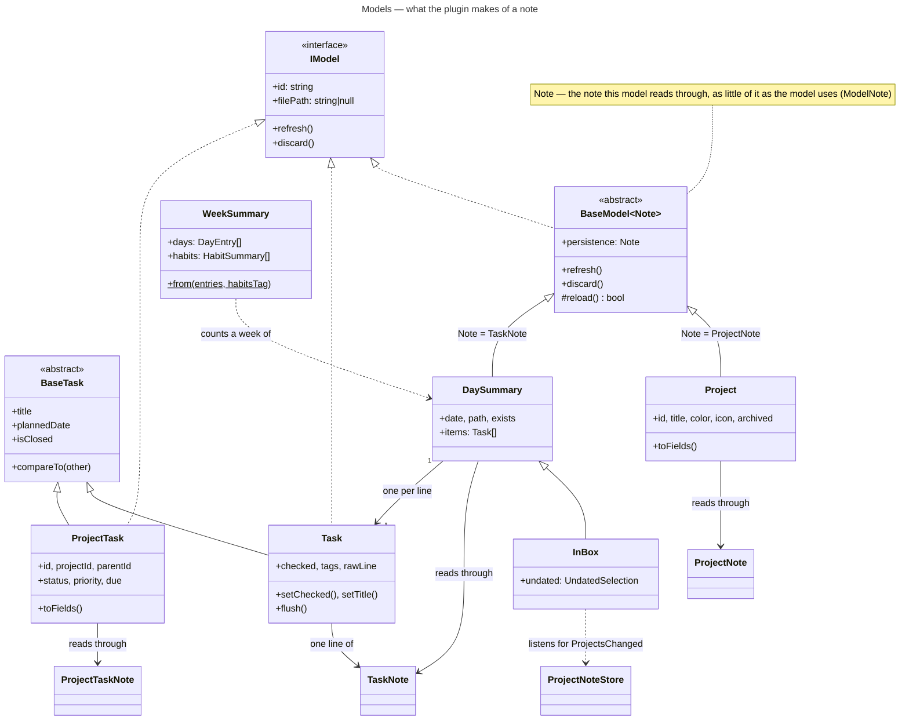
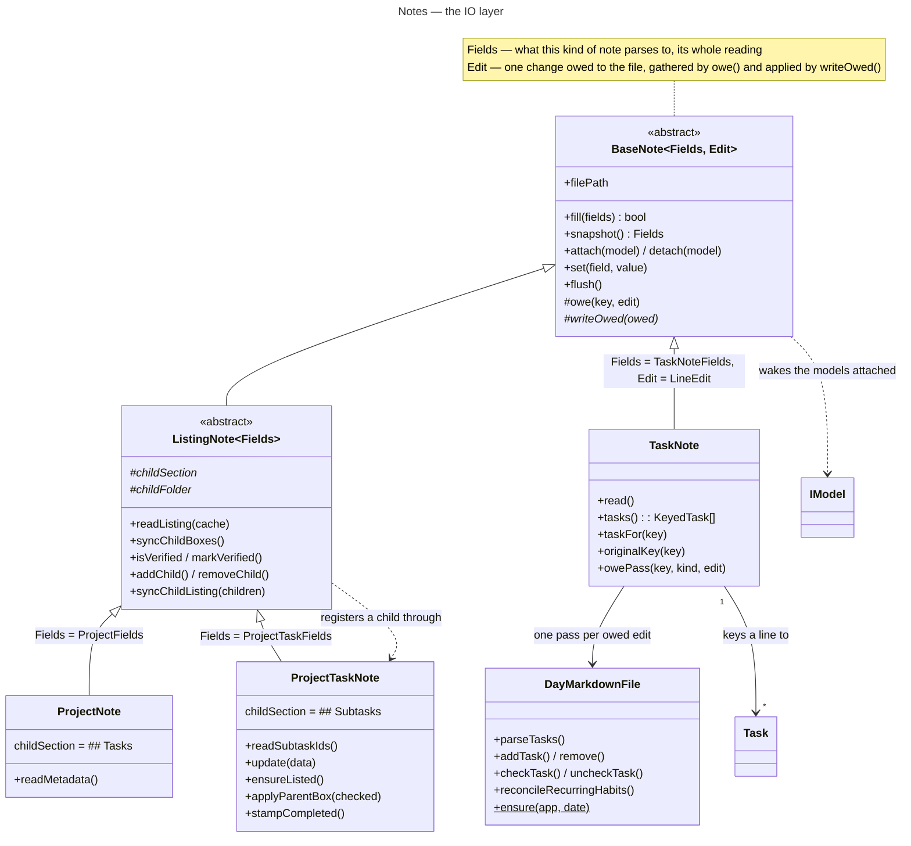
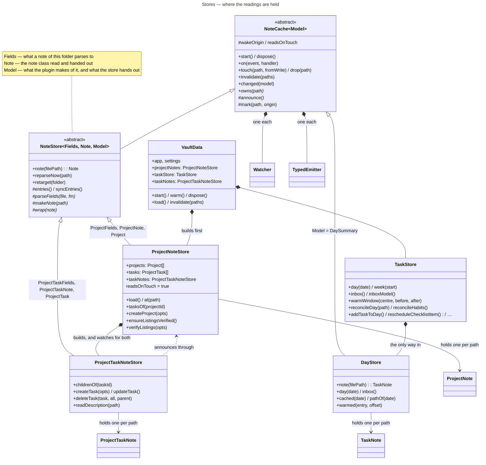
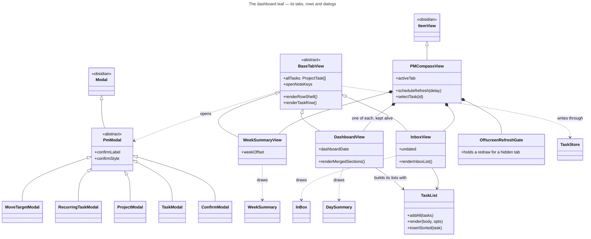
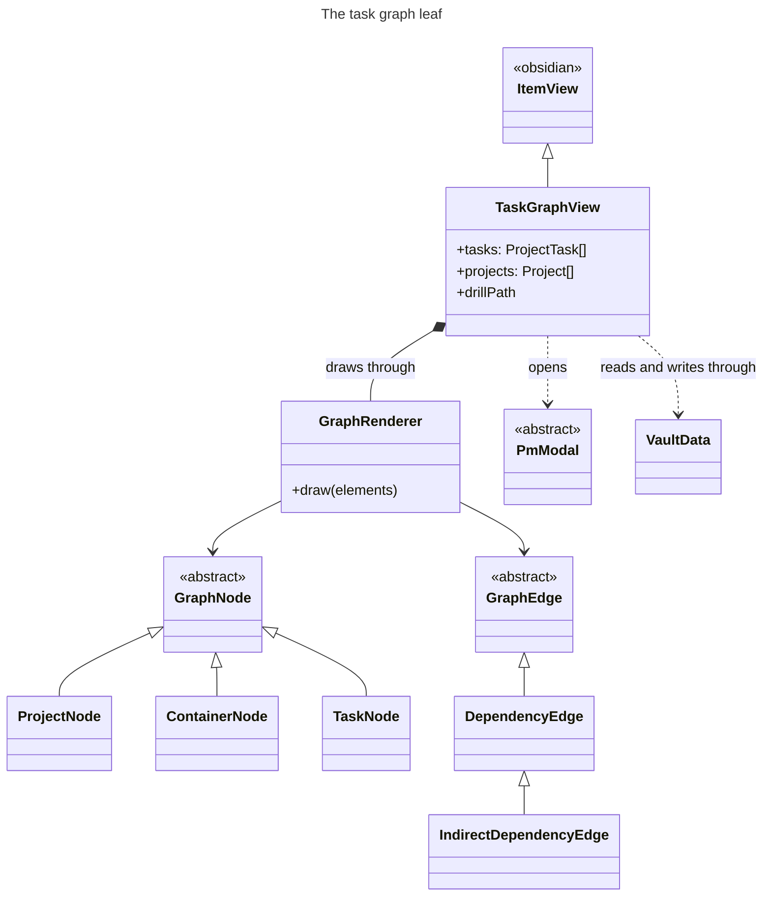
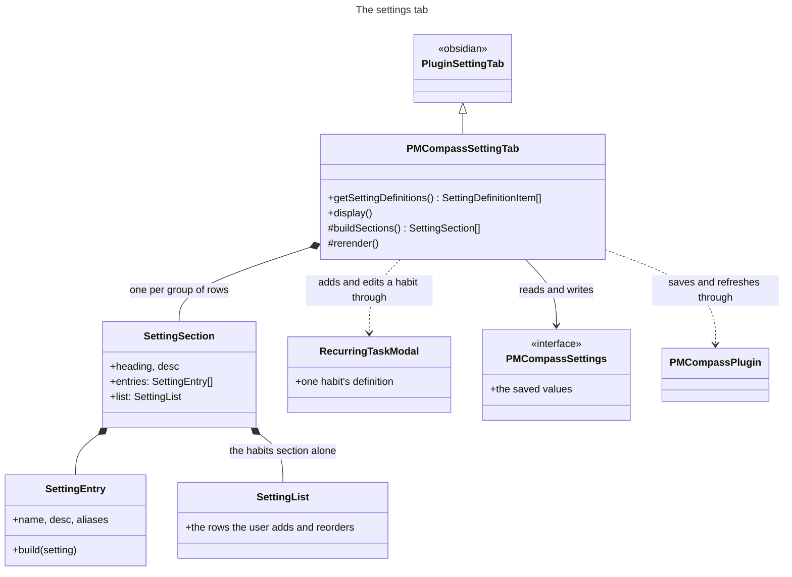

# Data model — the classes and what each is for

The plugin reads and writes ordinary markdown, and holds one live reading of every note it cares about. This document is what each class in that arrangement is responsible for, in the order the layers stack: the models a view holds, the notes underneath them that do the IO, the stores that hand the models out, and the watching that keeps all of it in step with the vault.

The diagrams are generated from `docs/technical/diagrams/*.mmd` by `pnpm docs:diagrams`, which also writes [class-map.html](class-map.html) — the same drawings on one page, for reading offline. Edit a `.mmd` and re-run the pass; the fences below are filled from it.

The listing subsystem — `## Tasks` / `## Subtasks` and how they are kept honest — has a document of its own: [task-listings.md](task-listings.md).

## How the layers fit

<!-- diagram:overview -->

<!-- /diagram -->

The design reverses the usual one: **a note holds none of what it says**. It reads its file, keeps that reading, and wakes the models attached to it; the models take the reading into state of their own, so what the plugin passes around is a live object rather than a copy that falls behind. A view holds models and redraws when its store says something moved.

That gives one rule per layer. A model never touches the vault. A note never decides what a change means. A store never parses a file itself — it says which notes are its own, and when the re-read happens.

<!-- diagram:change-flow -->

<!-- /diagram -->

Three windows sit between a keystroke and a redraw, in a fixed order. A write is gathered on the note and flushed on the next microtask, so ten setters cost one pass over the file. A burst of vault events is gathered by the watcher into one 50 ms window. And the view holds its redraw for as long as the change's origin deserves — 2 s for a note being typed into, 50 ms for a write the plugin made and the user is waiting on.

The rule that keeps the middle window honest: **a vault event marks a note stale at once, and only the telling is delayed**. A read taken straight after a write parses what it is owed before answering, whatever the coalescing is doing.

## Models

<!-- diagram:models -->

<!-- /diagram -->

### `IModel` — `src/model/i-model.ts`

**IModel** is responsible for taking a change to the data it holds:

- `refresh()` — that data has changed.
- `discard()` — that data is gone.

A model is identified by `id`, and by the `filePath` its data was read from — null for a model over nothing.

### `BaseModel<Note>` — `src/model/base-model.ts`

*abstract, implements `IModel`*

**BaseModel** is responsible for holding one note's reading and for announcing a change only when there is one:

- `refresh()` calls the abstract `reload()` and tells the store only when that reports the state moved.
- `discard()` detaches and announces the loss once, however often it is called.
- `reload()` is what a subclass answers, and all of it.

Its generic parameter `Note` extends [**ModelNote**](#modelnote--srcmodelbase-modelts), and is the note this model reads through.

### `ModelStore` — `src/model/base-model.ts`

**ModelStore** is responsible for collecting the changes models report — `changed(model)` — and passing them on to whoever listens. The IO layer listens to it, through [**NoteCache**](#notecachemodel--srcmodelstorenote-cachets).

### `BaseTask` — `src/model/base-task.ts`

*abstract*

**BaseTask** holds the information every task — [**Task**](#task--srcmodeldailytaskts), [**ProjectTask**](#projecttask--srcmodelprojectproject-taskts) — needs to be rendered or sorted:

- its `title`, and the `rowTitle(habitsTag)` a row prints.
- its `statusValue` and the `statusScale` it can be set to, and `isClosed`.
- its `ownPriority`, and the `priorityInForce` the tree around it makes.
- its dates — `plannedDate`, `ownDue`, `dueInForce`, `createdOn`, `closedOn`.
- its `tagNames`, and where it sits: `filePath`, `fileLine`.
- `compareTo(other, opts)`, which ranks on the `Status` and `Priority` enums declared here.

### `Task` — `src/model/daily/task.ts`

*extends `BaseTask`, implements `IModel`*

**Task** holds what one `- [ ] ` line says:

- its `title`, `checked` box and `tags`.
- its `priority`, off the marker the line carries — 🔺 critical, ⏫ high, 🔼 medium, 🔽 low, ⏬ lowest.
- its dates, likewise — ➕ `createdAt`, ⏳ `scheduledDate`, 🛫 `startDate`, 📅 `dueDate`, ✅ `completedAt`.
- the `rawLine` itself, its `lineIndex`, and the `subLines` indented under it.
- the note it came from: `filePath`, `noteDate`.

Identified by the key its line is filed under, a checklist line carrying no id.

It is made in two shapes:

- **bound**, by [**TaskNote**](#tasknote--srcmodelstoretask-notets) through `boundTo(note, key, store, date)` — attached to that note, so a re-read wakes it. This is the live model a view holds. Its setters owe the note a `LineEdit`: what the change does to the note's own reading, and the pass that puts it in the file.
- **parsed**, by `parseTasksFromLines` through `parse(line, index)` — a line turned into a task and nothing more: there is no note behind it, so nothing wakes it and its setters write nowhere. It is how [**DayMarkdownFile**](#daymarkdownfile--srcmodelstoreday-markdown-filets) *reads* a checklist — every task of a day, which lines are checked, which habits are already written down — and how it hands a removed task back to its caller. Changing one line needs none of this: the edit already says which line it is.

### `ProjectTask` — `src/model/project/project-task.ts`

*extends `BaseTask`, implements `IModel`*

**ProjectTask** holds what one obsidian-pm task note says:

- its `title`, `status`, `priority`, `type` and `progress`.
- its dates — `start`, `due`, `completed`, `createdAt`, `updatedAt`.
- its `tags`, `assignees` and `dependencies`.
- where it sits: `projectId`, `parentId`, and the `card` layout the graph left on it.

Identified by the `id` its frontmatter carries. The getters read state taken from the note, the setters write through it. Which tasks are its children is [**ProjectTaskNoteStore**](#projecttasknotestore--srcmodelstoreproject-task-note-storets)'s `childrenOf`.

**Made by** [**ProjectTaskNoteStore**](#projecttasknotestore--srcmodelstoreproject-task-note-storets) alone (`wrap` / `make`).

### `Project` — `src/model/project/project.ts`

*extends `BaseModel<ProjectNote>`*

**Project** holds what one project note says: its `title`, `color`, `icon`, `archived` flag and `card` layout. Identified by the `id` its frontmatter carries. Setting a field writes through the note. Which tasks it holds is [**ProjectNoteStore**](#projectnotestore--srcmodelstoreproject-note-storets)'s `tasksOf`.

**Made by** [**ProjectNoteStore**](#projectnotestore--srcmodelstoreproject-note-storets) alone.

### `DaySummary` — `src/model/daily/day-summary.ts`

*extends `BaseModel<TaskNote>`*

**DaySummary** is responsible for one day's checklist, kept live: one [**Task**](#task--srcmodeldailytaskts) per line, matched across re-reads by the key that line is filed under, and the lines gained and lost between two readings. Identified by its date and the path of its note.

**Made by** [**DayStore**](#daystore--srcmodelstoreday-storets) alone.

### `InBox` — `src/model/daily/inbox.ts`

*extends `DaySummary`*

**InBox** is responsible for everything written down and not yet placed, which comes in two halves:

- its own note's lines, held as any day holds them.
- the project tasks carrying a priority but no date, which no dashboard horizon holds.

It picks that second half again on `ProjectsChanged`, and announces only when what it holds moved.

### `WeekSummary` — `src/model/daily/week-summary.ts`

**WeekSummary** is responsible for aggregating a week of days into per-day completion counts and per-habit grids. `WeekSummary.from(entries, habitsTag)` builds one from the seven days it is handed and counts them there and then — the constructor is private, so there is no half-filled summary to fill in afterwards, and no reading of its own to keep current.

## Notes — the IO layer

<!-- diagram:notes -->

<!-- /diagram -->

### `BaseNote<Fields, Edit>` — `src/model/store/base-note.ts`

*abstract*

**BaseNote** is responsible for the IO over one file and for holding that file's reading, the only place it is kept. Identified by its path, one note per path. It parses nothing and decides nothing about what a change means:

- it holds the last reading, and says whether a fresh one moved.
- it turns a change into a write.

Two generic parameters:

- `Fields` extends `NoteFields` — what this kind of note parses to, its whole reading: `ProjectFields` for a project, `TaskNoteFields` for a day.
- `Edit`, `FieldEdit<Fields>` by default — what one change owed to the file looks like: the field edit a frontmatter note owes and `set` gathers, or a kind of the note's own, which is [**TaskNote**](#tasknote--srcmodelstoretask-notets)'s `LineEdit` over the lines of a checklist.

Reading: `fill(fields)` replaces the reading and wakes the models attached **only when it moved**, `sameFields` deciding that field by field. Suppressing that echo is this class's, and is what lets anything both listen for a change and write notes without hearing itself.

Writing: `owe(key, edit)` gathers a change under a key, wakes the models at once so what they say is never behind the file, and writes on the next microtask through the subclass's `writeOwed`. Passes are chained so two never interleave, and `saved` / `isDirty` say where the file stands against the reading.

### `ModelNote` — `src/model/base-model.ts`

**ModelNote** is responsible for answering the two things a model asks of the note it reads:

- `filePath` — where that note's data was read from.
- `attach(model)` / `detach(model)` — to be woken by that note from now on, or to stop being.

It is all a model ever asks of a note, and [**BaseNote**](#basenotefields-edit--srcmodelstorebase-notets) answers it. Declared over in the model layer so a model names no class of this one.

### `ListingNote<Fields>` — `src/model/store/listing-note.ts`

*extends `BaseNote`*

**ListingNote** is responsible for the `- [ ] [[child]]` checklist a project note or a task note carries below it — a project's `## Tasks`, a task's `## Subtasks`:

- reading the list, as part of the note's reading.
- adding an entry, dropping one, and rewriting a line.
- keeping the boxes and the tasks they name in step.

> **Note:** [**ProjectNote**](#projectnote--srcmodelstoreproject-notets) and [**ProjectTaskNote**](#projecttasknote--srcmodelstoreproject-task-notets) answer only which section holds the list (`childSection`) and where the children's notes sit (`childFolder`). A day note lists nothing, and is a [**BaseNote**](#basenotefields-edit--srcmodelstorebase-notets).

Its generic parameter `Fields` is [**BaseNote**](#basenotefields-edit--srcmodelstorebase-notets)'s, extending `ListingFields` so that the reading carries a listing.

`syncChildBoxes()` is the one way into the reconciling, choosing between `applyChildBoxes` — the boxes drive the tasks, for a listing known to have agreed with them — and `repairChildBoxes` — the statuses drive the boxes, for one seen for the first time. `isVerified` / `markVerified()` hold that standing on the note itself, for the session, outside the reading: a note whose standing changed hasn't moved as far as a view is concerned. Every write goes out through this class so that the listing it left comes back onto the reading, which is what keeps the plugin's own repair from reading as an edit.

### `ProjectNote` — `src/model/store/project-note.ts`

*extends `ListingNote<ProjectFields>`*

**ProjectNote** is responsible for one project note's file: its frontmatter as last read, the typed writes onto it, and its `## Tasks` list of root-level tasks. Nested tasks belong to their parent task's listing, not here.

**Made by** [**ProjectNoteStore**](#projectnotestore--srcmodelstoreproject-note-storets) alone; `vault.projectNotes.note(path)` is how everything else gets one.

### `ProjectTaskNote` — `src/model/store/project-task-note.ts`

*extends `ListingNote<ProjectTaskFields>`*

**ProjectTaskNote** is responsible for one task note's file:

- its frontmatter, and its body — the description, and the `Project:` / `Parent:` prefix naming where it is listed.
- its `## Subtasks` list.
- both directions of keeping it and its parent's listing in step: `pushToListing` puts its title and box onto the line that names it, `applyParentBox` closes or reopens it to match a box flipped by hand.
- `ensureListed()`, the one call that *adds* a line, for a task note nothing lists yet.
- `stampCompleted` / `needsCompletedStamp`, which put the `completed` date on a task closed anywhere else.

**Made by** [**ProjectTaskNoteStore**](#projecttasknotestore--srcmodelstoreproject-task-note-storets) alone.

### `TaskNote` — `src/model/store/task-note.ts`

*extends `BaseNote<TaskNoteFields, LineEdit>`*

**TaskNote** is responsible for one day note's file, or the inbox's: its lines as last read, and the checklist lines they parse to. The file being a list rather than a set of fields, it also answers for:

- keying every line — the title, plus which occurrence of that title it is.
- waking only the models whose line moved.
- following a line through a rename it wrote, rather than reporting one gone and another arrived.

Its edits are whole passes rather than field writes (`LineEdit`). Each carries two halves: `ahead`, which puts the change on this note's own line so the models are never behind the file, and `run(file)`, which the next `writeOwed` hands a [**DayMarkdownFile**](#daymarkdownfile--srcmodelstoreday-markdown-filets) to make the same change in the file.

**Made by** [**DayStore**](#daystore--srcmodelstoreday-storets) alone.

### `DayMarkdownFile` — `src/model/store/day-markdown-file.ts`

**DayMarkdownFile** is responsible for the read-modify-write of one daily note's checklist lines — parse, add, remove, check, retitle, reschedule, reconcile the recurring habits — under a per-path lock, so two passes over one file never clobber each other. It holds no reading between calls, and that is the point: every pass computes what to write from the file as it stands inside the lock, so an edit made in Obsidian's editor or landed by a sync since the last reading is never written over. `ensure(app, date)` creates the day's note through Templater when the vault has one.

> **Note:** it and [**TaskNote**](#tasknote--srcmodelstoretask-notets) sit on either side of the same file. **TaskNote** is one object per path, holding the reading the views are drawn from and the models over its lines; this one is built per call and holds nothing, so it owns no state a second instance could disagree with — what it does own is the writing, serialized by a lock keyed on the path rather than on the object. An edit crosses from one to the other on `writeOwed`.

## Stores

<!-- diagram:stores -->

<!-- /diagram -->

### `NoteCache<Model>` — `src/model/store/note-cache.ts`

*abstract*

**NoteCache** is responsible for one part of the vault, held one entry per note path: marking which entries have changed since they were last parsed, watching the vault through its own [**Watcher**](#watcher--srcmodeliowatcherts), and announcing through its own [**TypedEmitter**](#typedemitterevents--srcmodelstorestore-eventsts). A subclass answers:

- `owns(path)` — which paths are its own.
- `announce()` — what to tell the views when a window closes.
- `created` / `reparsed` / `deleted` — what an arrival, a re-parse and a deletion cost.

Its generic parameter `Model` is what it holds one of per path — what a note of this part of the vault reads as, and so what is handed out.

Of the notes `owns` claims, it keeps track of which have gone stale and reads them on demand, unless `readsOnTouch` says otherwise:

- `readsOnTouch` **true** — the note is read as the event lands, and the models over it report the change. A file that turns out to say what the store already held reaches no view. [**ProjectNoteStore**](#projectnotestore--srcmodelstoreproject-note-storets) works this way.
- `readsOnTouch` **false**, the default — the path is reported changed as the event lands, and the file read when something — a view for instance — next asks for that note. Cheaper, and noisier — it announces without knowing yet whether anything changed. [**DayStore**](#daystore--srcmodelstoreday-storets) works this way.

### `NoteStore<Fields, Note, Model>` — `src/model/store/note-store.ts`

*abstract, extends `NoteCache`*

**NoteStore** is responsible for one kind of note under a folder, and for everything held per path:

- which files under it are worth opening.
- the note object — `note(path)`, made once and kept, so a path has one reading.
- the model over it — `wrap`.
- the folder as a whole — `entries()`, memoized until something changes.

Nothing outside it makes a note object or a model.

Three generic parameters, one per layer it joins:

- `Fields` extends `ListingFields` — what a note of its folder parses to.
- `Note` extends [**ListingNote**](#listingnotefields--srcmodelstorelisting-notets) — the note class it makes and hands out.
- `Model` extends `StoredNote` — what the plugin makes of that note, which is [**NoteCache**](#notecachemodel--srcmodelstorenote-cachets)'s parameter and what a view ends up holding.

### `ProjectNoteStore` — `src/model/store/project-note-store.ts`

*extends `NoteStore<ProjectFields, ProjectNote, Project>`*

**ProjectNoteStore** is responsible for the projects folder, and the only maker of a [**Project**](#project--srcmodelprojectprojectts) and a [**ProjectNote**](#projectnote--srcmodelstoreproject-notets). It reads the folder in two passes — projects first — so a task's `projectId` names a project already read, and does the watching for **both** halves: [**ProjectTaskNoteStore**](#projecttasknotestore--srcmodelstoreproject-task-note-storets) announces through it.

Keeping the listings honest is also its, over the paths whose models actually woke, so a pass over an unchanged note costs nothing:

- `reconcileNote` — stamps a `completed` date, lists an arrival nothing lists yet, and syncs the listing in whichever direction that note calls for.
- `ensureListingsVerified()` — the once-a-session walk over the whole folder.
- `verifyListings(opts)` — the same walk on demand.

### `ProjectTaskNoteStore` — `src/model/store/project-task-note-store.ts`

*extends `NoteStore<ProjectTaskFields, ProjectTaskNote, ProjectTask>`*

**ProjectTaskNoteStore** is responsible for the task notes beside the projects, and the only maker of a [**ProjectTask**](#projecttask--srcmodelprojectproject-taskts) and a [**ProjectTaskNote**](#projecttasknote--srcmodelstoreproject-task-notets). It claims the notes [**ProjectNoteStore**](#projectnotestore--srcmodelstoreproject-note-storets) does not, and holds:

- the parent/child tree — `childrenOf`.
- a task note's whole life — creating it with its listing entry, updating it, deleting it with its subtasks.

### `DayStore` — `src/model/store/day-store.ts`

*extends `NoteCache<DaySummary>`*

**DayStore** is responsible for the day notes and the inbox, one summary per path, and the only maker of a [**TaskNote**](#tasknote--srcmodelstoretask-notets), a [**DaySummary**](#daysummary--srcmodeldailyday-summaryts) and an [**InBox**](#inbox--srcmodeldailyinboxts). Every reading is taken off the file rather than the metadata cache. The habit reconcile runs on a day note *created*, never on one changing, so a note being typed into is not rewritten under the cursor.

- `day(date)` — the day's summary, creating its note on demand.
- `inbox()` — the inbox, its checked lines pruned as it reads.
- `warmed` / `warmupFinished` — a horizon being filled a day at a time.

### `TaskStore` — `src/model/store/task-store.ts`

**TaskStore** is responsible for every read of and write to the day notes and the inbox — nothing outside reaches past it:

- the reads — `day`, `week`, `inbox`, `warmWindow`, `daysCached`.
- every write over a checklist — add, close, retitle, reprioritise, reschedule, reorder, move to the inbox, delete.
- the habit reconcile, debounced 800 ms and confined to **today or a later day in the current ISO week**, so a habit list edited today can't rewrite a note from earlier in the week.

Each write goes through `marking`, which invalidates the paths it touched whether or not the write threw. `on` passes through to [**DayStore**](#daystore--srcmodelstoreday-storets).

## Watching and events

### `Watcher` — `src/model/io/watcher.ts`

**Watcher** is responsible for hearing the vault: Obsidian's five create / modify / delete / rename / metadata subscriptions, gathered by its [**Coalescer**](../../src/model/io/watcher.ts) into 50 ms windows and reported as a path and a `Touch`.

- `Written` — a write landed, Obsidian's own reading a step behind.
- `Reparsed` — the metadata cache is current.
- `Created` — a note the vault didn't hold a moment ago.

### `TypedEmitter<Events>` — `src/model/store/store-events.ts`

**TypedEmitter** is responsible for the subscriber list of one store, one list per event. Subscribing hands back the unsubscribe rather than an `EventRef`; a handler that throws is logged and stepped over.

Its generic parameter `Events` is the map of event name to payload it carries: every store holds a `TypedEmitter<StoreEvents>`.

### `StoreEvent` and `ChangeOrigin`

`ProjectsChanged` is [**ProjectNoteStore**](#projectnotestore--srcmodelstoreproject-note-storets)'s; the rest are [**DayStore**](#daystore--srcmodelstoreday-storets)'s, which [**TaskStore**](#taskstore--srcmodelstoretask-storets) hands on.

| Event | Payload | Emitted by | Heard by |
| --- | --- | --- | --- |
| `ProjectsChanged` | `{ paths, origin }` | [**ProjectNoteStore**](#projectnotestore--srcmodelstoreproject-note-storets)`.announce` | [**PMCompassView**](../../src/ui/pm-compass-view.ts), [**TaskGraphView**](../../src/ui/task-graph-view.ts), [**InBox**](#inbox--srcmodeldailyinboxts) |
| `DaysChanged` | `{ paths, origin }` | [**DayStore**](#daystore--srcmodelstoreday-storets)`.announce` | [**PMCompassView**](../../src/ui/pm-compass-view.ts) |
| `InboxChanged` | `{ path }` | [**DayStore**](#daystore--srcmodelstoreday-storets)`.announce` | [**PMCompassView**](../../src/ui/pm-compass-view.ts) |
| `DayWarmed` | `WarmedDay` | [**DayStore**](#daystore--srcmodelstoreday-storets)`.warmed` | [**DashboardView**](../../src/ui/dashboard-view.ts) |
| `WarmupFinished` | `{ days }` | [**DayStore**](#daystore--srcmodelstoreday-storets)`.warmupFinished` | — |

`ChangeOrigin` says how soon a view should redraw:

- `Vault` — an edit from outside: a note being typed into, a sync landing.
- `Plugin` — a write of the plugin's own, which the view that asked for it is waiting on.

A window carrying both is told under `Vault`.

## `VaultData` — `src/model/store/vault-data.ts`

**VaultData** is responsible for everything the plugin holds: the projects folder as `projectNotes`, and the day notes and the inbox as `taskStore`. It builds the stores, starts them together and hands them out. Every store holds it back, which is how a note of one kind reaches a note of another.

- `start()` begins the watching, in `onload` — nothing that changes from that moment is missed.
- `warm()` waits for `onLayoutReady`, then loads the folder and starts the [listing pass](task-listings.md#the-opening-pass).
- `load()` reads the folder and builds the relationships neither note says: project → tasks, and the task tree.

It is built as a field of [**PMCompassPlugin**](../../src/main.ts), so a view constructed from a restored layout always finds it.

## The views

The plugin puts two leaves in the workspace and one tab in the settings, and each is drawn below on its own.

[**PMCompassPlugin**](../../src/main.ts) — what Obsidian loads. It is responsible for everything that outlives a view: the settings, the [**VaultData**](#vaultdata--srcmodelstorevault-datats) both leaves read through, the leaf types and the settings tab, and the two commands (backfill habits, repair listings).

### The dashboard leaf

<!-- diagram:ui-dashboard -->

<!-- /diagram -->

- [**PMCompassView**](../../src/ui/pm-compass-view.ts) — the "PM Dashboard" leaf. It is responsible for which tab is mounted, and for when the leaf redraws. It keeps one long-lived instance of each tab, so a tab's state survives being switched away from; it holds the redraw debounce, whose delay follows the `ChangeOrigin` of what changed; and it holds an [**OffscreenRefreshGate**](../../src/ui/offscreen-refresh-gate.ts), so a tab that is off screen redraws when it comes back rather than while it is away.
- [**BaseTabView**](../../src/ui/base-tab-view.ts) — it is responsible for everything the three tabs have in common: collapsible sections, both row renderers, the context menu, the promote-to-project-task flow, and which note panels stand expanded.
- [**DashboardView**](../../src/ui/dashboard-view.ts), [**InboxView**](../../src/ui/inbox-view.ts), [**WeekSummaryView**](../../src/ui/week-summary-view.ts) — the three tabs, each responsible for what its own screen shows and nothing else. Documented from a user's side in [dashboard.md](../guide/dashboard.md), [inbox.md](../guide/inbox.md) and [week-summary.md](../guide/week-summary.md).
- [**TaskList**](../../src/ui/task-list.ts) — the `<ul>` a list of tasks is made of. It is responsible only for where a row goes among the [**BaseTask**](#basetask--srcmodelbase-taskts)s it holds: the order, the drag-to-reorder the rows of one file share, and `insertSorted`, which drops a row into a drawn list without rebuilding it. What a row contains is the tab's.
- [**PmModal**](../../src/ui/pm-modal.ts) — it is responsible for everything a dialog does the same way: the confirm/cancel footer, the shortcuts and the closing, so [**ConfirmModal**](../../src/ui/task-creator.ts), [**TaskModal**](../../src/ui/task-creator.ts), [**ProjectModal**](../../src/ui/task-creator.ts), [**RecurringTaskModal**](../../src/ui/recurring-task-modal.ts) and [**MoveTargetModal**](../../src/ui/move-target-modal.ts) each answer only for their own body.

### The task graph leaf

<!-- diagram:ui-graph -->

<!-- /diagram -->

- [**TaskGraphView**](../../src/ui/task-graph-view.ts) — the "Task Graph" leaf. It is responsible for what the graph holds — every task and project as a dependency graph — and for what the user does to it: drilling down, dragging a card, drawing a dependency. Where it is drawn is [**GraphRenderer**](../../src/ui/graph-renderer.ts)'s, and how one card or one link draws itself belongs to the [**GraphNode**](../../src/ui/graph-node.ts) and [**GraphEdge**](../../src/ui/graph-edge.ts) families. See [graph-display.md](../guide/graph-display.md).
- [**GraphRenderer**](../../src/ui/graph-renderer.ts) — it is responsible for drawing the nodes and edges it is handed: placing them (`layoutGraph` unless the caller says otherwise, then whatever positions were stored against a card), panning and fitting, and turning a point on the page into the card under it. The plugin draws its own graph rather than through a graph library, and this is where that lives.

### The settings tab

<!-- diagram:ui-settings -->

<!-- /diagram -->

- [**PMCompassSettingTab**](../../src/ui/settings-tab.ts) — the settings screen. It is responsible for describing itself as sections of entries rather than drawing row by row, and answers both ways Obsidian asks for them: `getSettingDefinitions()` hands the description over on 1.13+, and `display()` draws the same sections itself on 1.12.x. Saving a value and telling the views to redraw goes through [**PMCompassPlugin**](../../src/main.ts). See [settings.md](settings.md).
