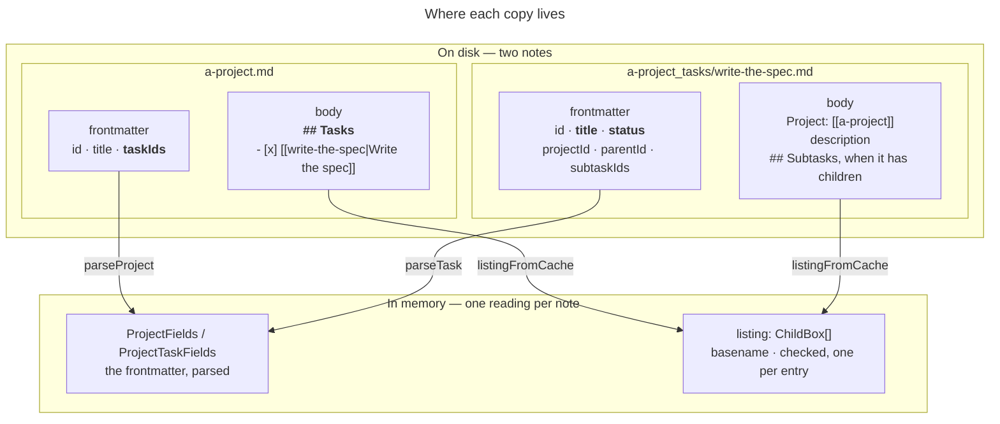
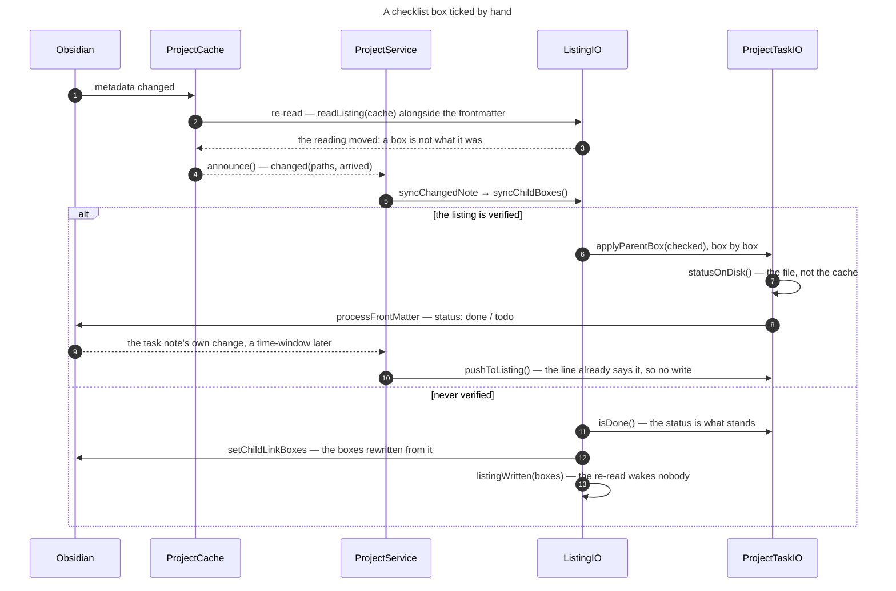
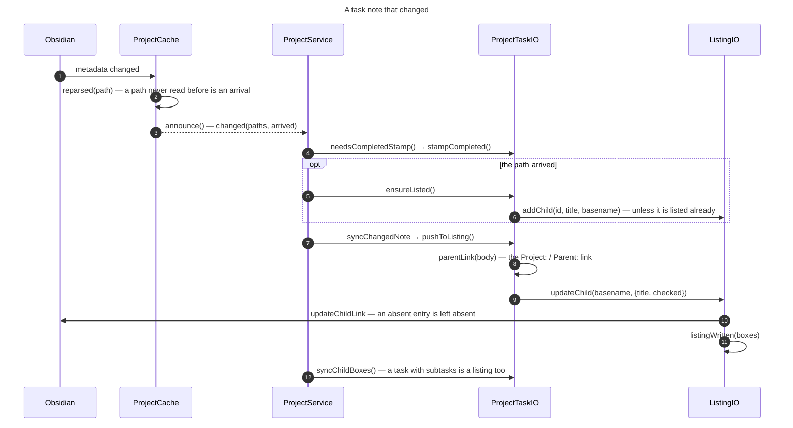

# Task listings — Technical Description

This document describes how [**ListingIO**](data-model.md#listingiofields-edit--srcmodeliolisting-iots) and the two classes that extend it — [**ProjectIO**](data-model.md#projectio--srcmodelioproject-iots) for tasks listed at the project level, [**ProjectTaskIO**](data-model.md#projecttaskio--srcmodelioproject-task-iots) for subtasks listed under a task — keep each checklist in step with the frontmatter of the tasks it names:

- Where each copy of a task lives, and what a model holds of it.
- Which way a change travels between a box and the frontmatter of the task it points at.
- When a ticked box may close that task, and when it is rewritten from the status instead.
- What the pass at the start of a session repairs, and what it only counts.
- What none of it will touch in a section the user owns.

A project note lists its root tasks under `## Tasks`; a parent task lists its subtasks under `## Subtasks`. Both are the same thing — a checklist of wiki-links to the notes below them — and both are **derived**: the task notes are the source of truth, the listing is a copy kept for obsidian-pm and for reading a project as a note. For instance:

```markdown
---
pm-project: true
taskIds: ["a1b2c3d4e5f60718", "0918273645abcdef"]
---

## Tasks
- [x] [[write-the-spec|Write the spec]]
- [ ] [[ship-it|Ship it]]
```

The frontmatter id list and the body checklist say the same thing twice. The id list is what obsidian-pm reads; the checklist is what a person reads and — because a checkbox in a note is a thing people click — what a person edits.

The module `model/project/child-links.ts` holds the markdown-level work all three go through: finding the section, matching an entry, rewriting one.

## The data model

The model is read out of the notes, and the notes carry redundancy: only the frontmatter and the checklist are held in memory, the other copies being rebuilt from them when something needs one.

<!-- diagram:listing-copies -->



<!-- /diagram -->

Two parts to a note, four places between them, of which one is the source of truth — and what a model holds of each:

- The **note's own frontmatter**:
  - A task's `status`, `title`, `parentId` and `projectId`; a project's `id`, `title` and the rest of what a project is. Parsed by `parseProject()` into `ProjectFields`, and by `parseTask()` into `ProjectTaskFields`. This is the source of truth: the only one of the four that anything reads to answer a question about the task. The copies are never consulted — a clicked box is an edit, answered by writing this frontmatter, the way the dashboard's own controls are.
  - Its id list — `taskIds` on a project, `subtaskIds` on a task. The copy obsidian-pm reads, and the only part of a listing carrying ids. No reading holds it: `syncChildLinks()` rebuilds it from the tasks that exist, in the order it already had.
- The **note's body**:
  - A task note opens with a `Project: [[a-project]]` or `Parent: [[some-task]]` line — the wiki-link naming the note whose checklist carries this task's entry, and the only place a task records where it is listed. No reading holds it: `setBodyPrefix()` rebuilds it from the task's `parentId`.
  - Past the description, the note's own section — `## Subtasks` on a task, `## Tasks` on a project — as `- [x] [[basename|Title]]` lines naming its children. The copy a person reads, and the only one a person can edit by clicking. `listingFromCache()` turns it into that note's `listing`, one `ChildBox` — a `basename` and a `checked` — per entry.

Two things live in memory only:

- `ChildEntry` — an `id`, `title`, `basename` and `checked`: one task as its parent *should* list it. Built from the task's own frontmatter for one call to `syncChildListing()`, and gone after it.
- `verified` — a flag on the [**ListingIO**](data-model.md#listingiofields-edit--srcmodeliolisting-iots), outside the reading it holds and kept for as long as the session. See [the verification problem](#the-verification-problem).

**While the frontmatter is right, nothing is lost.** The Dashboard and the Task Graph are built from it alone, and a listing that has drifted is rebuilt from it — so a bug in the whole subsystem below costs a stale checklist rather than a task.

## The synchronization mechanism

There are two of them, and the vault decides which is needed:

- **Online** — note by note, off the change events the plugin hears while it runs.
- **Offline** — a walk over the whole folder at the start of a session, because a vault changes when nobody is watching: a sync landing files, an edit made on a phone, a note restored from a backup.

## Online synchronization

Changed notes arrive in batches. [**ProjectCache**](data-model.md#projectcache--srcmodelcacheproject-cachets) gathers a burst of vault events into a 50 ms **time-window**, and when it closes it hands [**ProjectService**](data-model.md#projectservice--srcmodelserviceproject-servicets)`.changed()` the notes whose reading moved, marking those the folder had never held before. `reconcileNote()` is then run on each note in turn, and does three things:

- It stamps `completed` where a status edited elsewhere left it off.
- It calls [`ensureListed()`](#listing-a-task-that-arrived-from-outside) where the note came from outside.
- It calls `syncChangedNote()` (`model/project/listing-sync.ts`), which picks the direction of the update from the file that changed.

That last one is the sync proper:

- A **project note** — [**ListingIO**](data-model.md#listingiofields-edit--srcmodeliolisting-iots)`.syncChildBoxes()` puts its `## Tasks` and the tasks they name back in step. Which of the two gives way depends on the [`verified`](#the-verification-problem) flag: the boxes drive the tasks for a listing known to agree with them, the statuses rewrite the boxes for one that has never been checked.
- A **task note** — it drives the line listing it in its project or parent ([**ProjectTaskIO**](data-model.md#projecttaskio--srcmodelioproject-task-iots)`.pushToListing()` → `updateChildLink()`), unconditionally. `syncChildBoxes()` then does the above for its own `## Subtasks`. Both run: they touch different files.

Each write is itself a file change, which wakes the other direction. **Neither direction writes when nothing moved**, and that is what stops the pair running forever:

- `rewriteChildLinks()` compares its output with the section it read, and leaves the file alone when they match.
- `applyParentBox()` takes *what* to write from the box that was ticked; the cache and then the file only say *whether* to write at all — the parent's event can outrun the child's own reparse, so the file has the last word. Both guards come before `processFrontMatter()`, which would rewrite the note whatever its callback did.

`model/project/listing-convergence.test.ts` drives each kind of edit through both directions and asserts the writes stop.

### A box ticked by hand

The first direction, end to end: a `## Tasks` line flipped in the editor, and the task it closes — or, where the listing has never been checked against its tasks, the status that rewrites the box instead.

<!-- diagram:listing-box-ticked -->



<!-- /diagram -->

1. Obsidian reports the change to its metadata cache.
2. [**ProjectCache**](data-model.md#projectcache--srcmodelcacheproject-cachets) re-reads the note — frontmatter and checklist in one pass, both off that same cache, so no file is opened.
3. `listing` is a field like `status`, so the flipped box moves the reading and wakes the model.
4. The time-window closes, and the paths that moved go to [**ProjectService**](data-model.md#projectservice--srcmodelserviceproject-servicets)`.changed()`.
5. `syncChangedNote()` asks the listing for `syncChildBoxes()`, which, based on the [`verified`](#the-verification-problem) flag, goes to 6 for a listing known to agree with its tasks, or to 11 for one that has never been checked.
6. *Verified* — each box is pushed onto the task it names, a disagreeing one being a fresh edit.
7. [**ProjectTaskIO**](data-model.md#projecttaskio--srcmodelioproject-task-iots) checks the file before writing, the cache being able to lag a step behind.
8. It writes the status: `done` for a ticked box, `todo` for a cleared one.
9. That write is a change of its own, and comes back a time-window later.
10. The other direction runs, finds the line already right, and writes nothing.
11. *Never verified* — the task's status stands instead.
12. The boxes disagreeing with it are rewritten in one pass over the section.
13. What that write left goes onto the note's own reading, so the re-read wakes nobody.

> **Note:** a note the folder has never read holds no listing to be asked for at 6 or 11. [**ListingIO**](data-model.md#listingiofields-edit--srcmodeliolisting-iots)`.childBoxes()` reads the metadata cache on the spot for it, so a listing edited before its folder was walked is answered from what it says now.

### A task note that changed

The other direction: updating the task list according to a change in a task's title or status. [**ProjectService**](data-model.md#projectservice--srcmodelserviceproject-servicets) does two things around that:

- It stamps `completed` where a status edited elsewhere left it off.
- For a task note that has just arrived, it adds the line instead of only mirroring onto one.

<!-- diagram:listing-task-changed -->



<!-- /diagram -->

1. Obsidian reports the change to its metadata cache.
2. [**ProjectCache**](data-model.md#projectcache--srcmodelcacheproject-cachets) re-reads the note, and files the path as an *arrival* when it has never read that file before, as a project note or as a task note.
3. The time-window closes, and the paths that moved go to `changed()` with the arrivals among them.
4. A task reading as `done` with no `completed` stamp is stamped — before the sync, so the two don't write the note at once.
5. *An arrival* — [**ProjectTaskIO**](data-model.md#projecttaskio--srcmodelioproject-task-iots)`.ensureListed()` finds the note that should hold its line.
6. It adds the entry, unless that listing already names the task.
7. `syncChangedNote()` then mirrors the task onto its line.
8. Where that line sits comes off the `Project:`/`Parent:` link opening the body — cf. [where a task's own entry lives](#where-a-tasks-own-entry-lives).
9. The title and the box are handed to the note that holds the line — the project, or the parent task.
10. An entry that isn't there is left absent: this direction only mirrors, and 5 is the one step that adds.
11. What the write left goes onto that note's reading.
12. The task is asked for its own boxes too — it lists as well as being listed.

### The write-loop guard

A reconciler that listens for changes and writes notes would hear its own writes come back. [**ListingModel**](data-model.md#listingmodelfields--srcmodeliolisting-iots)`.listingWritten()` moves the reading ahead to what was just written, so the re-read that follows wakes nobody. Every write leaves through [**ListingIO**](data-model.md#listingiofields-edit--srcmodeliolisting-iots), [**ProjectTaskIO**](data-model.md#projecttaskio--srcmodelioproject-task-iots)`.syncParentListing()` included, which is what makes that exhaustive.

### Listing a task that arrived from outside

A task note can appear in the folder without this plugin creating it — synced from another device, written by hand in the editor, copied in, or made by obsidian-pm. Nothing lists it, and mirroring never will: `updateChildLink()` rewrites an entry that exists and does nothing when the section holds none, so it cannot create a task's **first** entry.

[**ProjectTaskIO**](data-model.md#projecttaskio--srcmodelioproject-task-iots)`.ensureListed()` is the one case that adds one. Two conditions together identify a note the plugin has never handled itself:

- The folder has **never read that path before**, neither as a project note nor as a task note.
- The plugin has not just written it: every note it writes is marked as owing a re-read off the file, and a path carrying that mark is never filed as an arrival.

The first alone would not do, being true of the plugin's own new notes: [**ProjectService**](data-model.md#projectservice--srcmodelserviceproject-servicets)`.createTask()` and `moveTask()` (`model/project/task-move.ts`) write a note nothing has read before, and list it themselves — so `ensureListed()` would add a second entry beside theirs.

Where the parent already names the arrival — a synced note landing beside the listing that names it, say — `ensureListed()` finds the entry among the boxes it holds and writes nothing.

> **Note:** the [opening pass](#the-opening-pass) is no substitute. It runs once a session, so a note Obsidian had yet to index when the plugin loaded is one its walk never held, and it never returns to notice.

> **Note:** none of this applies to a task created in pm-compass. `createTask()` writes the note and its entry in one go, so it is listed from the start.

### The limits of the online update

Online update answers the note that changed, not the folder around it. Two kinds of drift are therefore invisible to it, and wait for [offline synchronization](#offline-synchronization) to straighten out:

- **A task re-parented by hand.** `pushToListing()` finds the parent from the `Project:`/`Parent:` link in the body, which editing `parentId` in the frontmatter leaves untouched. So the *old* parent's line is refreshed, no line appears under the new one, and neither id list moves — the graph shows the new parentage while both listings still show the old.
- **An entry whose task is no longer a child.** Nothing online removes an entry: `syncChildBoxes()` reconciles boxes, and `updateChildLink()` only rewrites a line already there. One left behind by a move stays until the pass rebuilds the section from the tasks that exist.

A task *deleted* is not among them — `unlinkDeletedTask()` drops its entry off the vault's `delete` event, where the path is exact.

### Living beside obsidian-pm

A write of obsidian-pm's arrives here as an ordinary change, and both plugins take the task's own frontmatter as the source of truth — the schema is obsidian-pm's. So when it writes both sides consistently, this sync confirms and stops: `pushToListing()` finds the line already right, `applyParentBox()` finds the status already matching its box, and neither writes.

A box written by obsidian-pm is indistinguishable from a box a person clicked, and a verified listing reads both as an edit. That costs nothing while the box only moves because the status did — the write it provokes is a no-op.

Two places accommodate the other plugin deliberately:

- `syncChildLinks()` keeps whatever order the id list already had, so a repair that changes nothing else can't reshuffle a field obsidian-pm writes too and hand Obsidian Sync a conflict for free.
- [**ProjectService**](data-model.md#projectservice--srcmodelserviceproject-servicets)`.createProject()` emits obsidian-pm's full frontmatter, fields this plugin never reads included, so a project made here is indistinguishable from one made there.

> **Note:** four body writers still read a note and then overwrite it — `rewriteChildLinks()`, `addChildLink()`, `setBodyPrefix()` and `update()` — so a write landing between the two `await`s is lost. `syncChildLinks()` and `removeChildEntry()` go through `vault.process()` for exactly that reason. No later pass can repair such a loss: the copies all agree with the value that survived, so nothing reads as inconsistent.

## Offline synchronization

Nothing tells the plugin what moved while it was not running, so a session opens by walking the folder whole: every listing made to agree with the tasks that exist, and every note it covers taken as checked from then on.

### The verification problem

A box that disagrees with the task it names means one of two opposite things:

1. Someone just ticked it, and the task should close.
2. The note predates the sync (or was written by hand, or restored from a backup), so the box was never meaningful and should be rewritten from the status.

Nothing in the note tells them apart. Reading (1) when the truth is (2) closes tasks nobody touched; reading (2) when the truth is (1) discards a tick, which the user can simply make again. The recoverable mistake is the one to prefer, so **(2) is the default**, and (1) is read only where the listing is *known* to have agreed with its tasks at some earlier point.

The `verified` flag is that knowledge. It is held for the session only: a note can change between two runs of the plugin, so a stored flag would be a claim about a file nobody was watching. A note leaving its path — a `delete`, or a `rename` seen under the old path — takes its flag with it, and whatever lands there next is a note nobody has checked.

An unverified listing costs one tick: the first box flipped in it goes towards checking the listing rather than closing the task it names.

### The opening pass

`repairListings()` (`model/project/listing-repair.ts`) is that walk, and it is run two ways: once per session from the cache's warm-up, and whenever the user picks **"Check project and subtask listings against the tasks that exist"** from Obsidian's command palette. The two differ only in what they are allowed to repair — see the dangling ids below — and the command reports what it did in a notice. Over every project and every task the walk:

- adds missing entries, refreshes titles, matches boxes to statuses and drops departed entries;
- puts each task's `Project:`/`Parent:` prefix back in step with its `parentId`, which `moveTask()` (`model/project/task-move.ts`) writes together with the listing but commits separately;
- marks every note it covers [verified](#the-verification-problem).

Two things about its reach:

- It walks **every** live task, not only those with children now: a task that has lost its last subtask still carries that subtask's line and id. One with neither costs a read and no write.
- Archived projects are left out, and left **unmarked** — the pass doesn't rewrite notes that have been put away, and their listings earn their standing the first time they change, like any note it never reached. [**ProjectService**](data-model.md#projectservice--srcmodelserviceproject-servicets)`.archivedCount` is how many were skipped, for the command's notice.

It holds eight notes open at a time (`REPAIR_CONCURRENCY`), so a folder of hundreds is neither read one note at a time nor landed on a phone in a single burst.

#### Tasks whose frontmatter names something that isn't there

**A `parentId` naming a task the folder doesn't hold.** The task is listed as a root of its project, under `## Tasks` with a `Project:` prefix — there is nowhere else to put it. Only the frontmatter still says otherwise.

Clearing the id is the repair that puts it in line, and the pass only does it when a person ran it from the command (`RepairOpts.clearDanglingParents`) — not when it runs itself at the start of a session, where a parent note a sync has yet to deliver looks exactly like one that never existed.

**A `projectId` naming no project in the folder** is counted and never repaired. Nothing holds such a task and nothing lists it, but which project it meant is not in the note, and a guess would file it under the wrong one. The count goes in the command's notice, to be fixed by hand.

**A note marked `pm-task: true` that cannot be read as a task** never reaches the pass at all, being absent from the task list it is handed. [**ProjectCache**](data-model.md#projectcache--srcmodelcacheproject-cachets)`.unreadableTaskNotes()` counts them instead, comparing the folder's files against the tasks it holds. There are two kinds: a note `parseTask()` cannot place, wanting an `id` and a `projectId`, and a second note claiming an id another already has. Both are reported and never repaired — nothing in such a note says what it was meant to be.

#### When the pass runs

The warm-up **starts** the pass without awaiting it ([**VaultData**](data-model.md#vaultdata--srcmodelservicevault-datats)`.warm()` → [**ProjectService**](data-model.md#projectservice--srcmodelserviceproject-servicets)`.ensureListingsVerified()`): the start of a session rather than the first render, so it happens whether or not a dashboard is ever opened. Blocking on it would buy nothing — a note it has not reached yet is exactly the unverified case online sync already handles — and it reads every project and task note, which on a large vault is a visible stall. The `verifyListingsOnLoad` setting ([settings.md](settings.md)) turns it off entirely, leaving each note to earn its standing the first time it changes.

The warm-up waits for `workspace.onLayoutReady` first, and that wait is what makes the pass mean anything: `onload()` runs before Obsidian has finished listing the vault, so a folder walked there holds only the files the tree happened to have reached, and a pass that runs once a session would vouch for those few and never return. Watching still starts in `onload()` — nothing changing from that moment is missed, and only the first read waits.

The pass writes nothing on a vault already in step. The frontmatter is guarded separately, `processFrontMatter()` rewriting a file whatever its callback does: without that, `touch()` would stamp `updatedAt` on every note in the vault on every pass.

## Entries the plugin does not own

A `## Tasks` section is an ordinary markdown heading in a note the user owns, and `[[2026 Q3 review]]` may well be sitting under it because they put it there.

So an entry is touched only on positive evidence that the plugin wrote it:

- **Removed** when its basename resolves to a `pm-task` note in the folder the children live in — that is a task of this parent's, gone elsewhere. Everything else stays: a folder lookup cannot tell a link the user wrote from a task note since deleted, and an unattended pass over every project in the vault must not guess.
- **Its box rewritten** on the same test. `repairChildBoxes()` asks each entry's note whether it is done, and `isDone()` answers null for anything that is not a task note, so a link the user wrote keeps whatever box they gave it.

That leaves one real gap: a task deleted **outside** the plugin, whose file is gone and whose entry now looks like a link to a note not yet created. `unlinkDeletedTask()` closes it from the other side, off the vault's `delete` event, where the deletion is the evidence and the path is exact. It tries the project note owning the folder first — one read, and the common case — then only the sibling tasks whose cache shows a non-empty `subtaskIds`, so a 200-task project costs one read rather than 200. The stale id is left for the next `syncChildLinks()` to prune, and the body edit goes through `vault.process()`: the event fires part-way through [**ProjectTaskIO**](data-model.md#projecttaskio--srcmodelioproject-task-iots)`.delete()`, so the two can be editing one note at once.

## Matching an entry

Two regexes read the checklist, both anchored to the start of a line. An indented `- [ ] [[some-task]]` nested under an entry is the user's own breakdown of it, and is neither read as a child nor rewritten as one. Edits are confined to the span between the section's heading and the next `## ` heading, so a checklist line quoted in a task's description can't be mistaken for the real entry, and the heading match is itself line-anchored so a `### Tasks` sub-heading doesn't open a section.

`listingFromCache()` matches exactly as narrowly, in the cache's own terms: a level-2 heading, an unindented list item, a `[ ]`/`[x]` box — Obsidian calls any character a box, this plugin only writes those — and the link starting at the column right after it, so `- [ ] see [[task]]` is prose that happens to link rather than an entry.

Entries are written `- [x] [[basename|Title]]` but matched with the alias optional, so a hand-edited `[[basename]]` is still found; rewriting one keeps it bare.

`- [x]` means **done** specifically. A cancelled task is closed but was never finished, so its box stays clear, and unticking a box reopens a task as `todo`.

## Where a task's own entry lives

The reverse lookup — given a task, which note lists it? — is read off the `Project: [[…]]` / `Parent: [[…]]` wiki-link that opens the task's body, not off its `parentId`. The link names a basename, which is what the checklist matches on, and it travels in the same file as the task. `projectFileForTask()` reads `<project>_tasks/` back to `<project>.md` for the `Project:` case. A task with no such prefix — a hand-made note — has no entry to sync, and is left alone rather than guessed at.

An arrival is the one lookup that goes further, since a note with no line yet has nothing to be left alone with: a task that names no parent and opens with no prefix is placed by the folder it sits in, `_tasks/` naming its project as surely as the link would have. A task that names a `parentId` and opens with no prefix is not — which sibling that id is, is not in the note and not in the folder either — and waits for the opening pass, which reads the whole folder and can answer it.
